<!-- markdownlint-disable MD001 -->
<!-- markdownlint-disable MD012 -->
<!-- markdownlint-disable MD022 -->
<!-- markdownlint-disable MD024 -->
<!-- markdownlint-disable MD025 -->
<!-- markdownlint-disable MD026 -->
<!-- markdownlint-disable MD029 -->
<!-- markdownlint-disable MD040 -->
<!-- markdownlint-disable MD056 -->
<!-- markdownlint-disable MD060 -->

# LangChain `Runnable` Interface: Reference

- Scope: the `Runnable` contract, every variant of it, and its behavioral rules.
- Verified: every code block was executed against `langchain-core 1.6.6` (October 2026).
- Offline execution: `FakeListChatModel` replaces a real provider for deterministic runs.  
  Replace with `init_chat_model(...)` for real use.
- Progression: Level 1 (primitives), Level 2 (components, streaming, routing, modifiers), Level 3 (custom runnables, full pipeline).

## Contents

1. [Definition](#1-definition)
2. [Execution surface](#2-execution-surface)
3. [Config](#3-config)
4. [Variants](#4-variants)
5. [Level 1: contract and composition](#5-level-1-contract-and-composition)
6. [Level 2: components, streaming, routing, modifiers](#6-level-2-components-streaming-routing-modifiers)
7. [Level 3: custom runnables and a full pipeline](#7-level-3-custom-runnables-and-a-full-pipeline)
8. [Behavioral rules](#8-behavioral-rules)
9. [Lookup tables](#9-lookup-tables)

---

## 1. Definition

`Runnable` is the abstract base class in `langchain_core.runnables` that standardizes a unit of work: one input, one output, one execution surface.

Prompts, chat models, output parsers, retrievers, tools, and compiled LangGraph graphs all implement it.  
Composition, streaming, batching, tracing, retries, and config propagation operate on the interface, not on the concrete component.

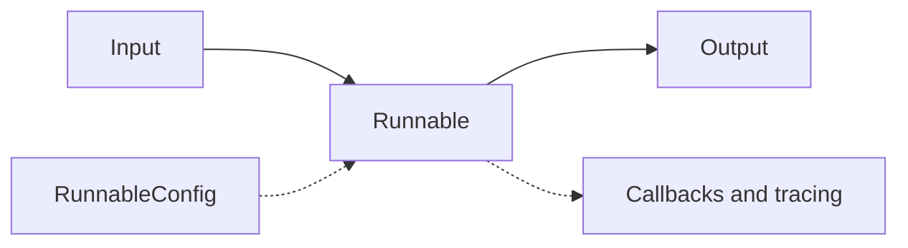

---

## 2. Execution surface

| Method | Behavior |
|---|---|
| `invoke` / `ainvoke` | One input, one output |
| `stream` / `astream` | Yields output chunks incrementally |
| `batch` / `abatch` | List of inputs, list of outputs. Thread pool or async gather, bounded by `max_concurrency` |
| `batch_as_completed` / `abatch_as_completed` | Yields `(index, output)` in completion order, not input order |
| `transform` / `atransform` | Input iterator to output iterator (stream in, stream out) |
| `astream_events(version="v2")` | Typed event stream covering every nested step |
| `input_schema`, `output_schema`, `get_graph()`, `get_name()` | Introspection |

Minimum implementation is `invoke`.  
The base class derives `batch` (thread pool), `ainvoke` (executor), `stream` (single chunk), and the other async variants.

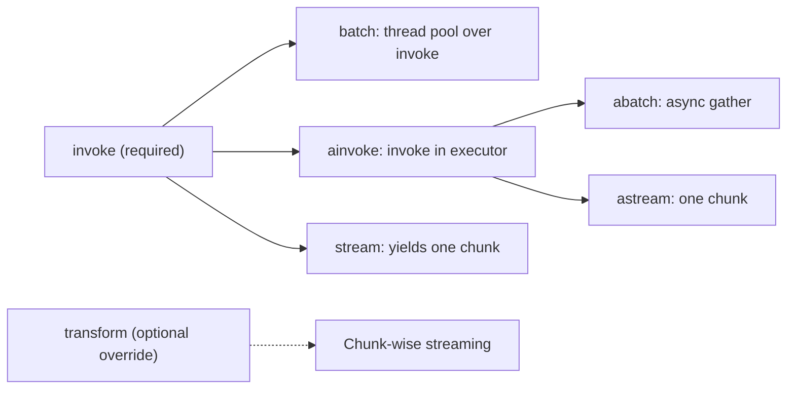

---

## 3. Config

Every method accepts `config: RunnableConfig` as the second argument.

| Key | Purpose |
|---|---|
| `tags` | Labels attached to the run and its children |
| `metadata` | Key-value data attached to the run and its children |
| `callbacks` | Handlers receiving start, end, and error events |
| `run_name` | Trace name |
| `max_concurrency` | Upper bound for `batch` and parallel branches |
| `recursion_limit` | Step limit (used by LangGraph) |
| `configurable` | Runtime values for `configurable_fields` and `configurable_alternatives` |
| `run_id` | Explicit run identifier |

Config propagates from a composed runnable to its children. A callback handler attached once at the top observes every nested step.

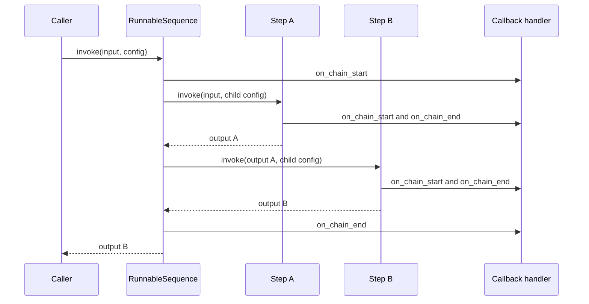

---

## 4. Variants

```mermaid
flowchart TD
    R["Runnable (abstract base)"]

    R --> COMP["Composition primitives"]
    R --> MOD["Modifiers"]
    R --> DOM["Domain components"]

    COMP --> C1["RunnableSequence"]
    COMP --> C2["RunnableParallel"]
    COMP --> C3["RunnableLambda"]
    COMP --> C4["RunnableGenerator"]
    COMP --> C5["RunnablePassthrough"]
    COMP --> C6["RunnableAssign"]
    COMP --> C7["RunnablePick"]
    COMP --> C8["RunnableBranch"]
    COMP --> C9["RouterRunnable"]
    COMP --> C10["RunnableEach"]

    MOD --> M1["RunnableBinding"]
    MOD --> M2["RunnableRetry"]
    MOD --> M3["RunnableWithFallbacks"]
    MOD --> M4["RunnableConfigurableFields"]
    MOD --> M5["RunnableConfigurableAlternatives"]
    MOD --> M6["RunnableWithMessageHistory (deprecated)"]

    DOM --> D1["Prompt template"]
    DOM --> D2["Chat model and LLM"]
    DOM --> D3["Output parser"]
    DOM --> D4["Retriever"]
    DOM --> D5["Tool"]
    DOM --> D6["Compiled LangGraph graph"]
```

### 4.1 Composition primitives

| Class | Created by | Role |
|---|---|---|
| `RunnableSequence` | `a \| b`, `a.pipe(b)` | Serial composition. Output of `a` is input of `b` |
| `RunnableParallel` (alias `RunnableMap`) | `RunnableParallel(k=r)`, dict literal piped into a runnable | Same input fanned out to all branches concurrently. Output is a dict |
| `RunnableLambda` | `RunnableLambda(fn)`, `@chain` | Wraps a function |
| `RunnableGenerator` | `RunnableGenerator(gen_fn)` | Wraps a generator over an input iterator. Preserves chunk streaming |
| `RunnablePassthrough` | `RunnablePassthrough()` | Identity |
| `RunnableAssign` | `RunnablePassthrough.assign(k=fn)` | Adds keys to a dict, retaining existing keys |
| `RunnablePick` | used inside `.pick("k")` or `.pick(["a","b"])` | Selects keys from a dict |
| `RunnableBranch` | `RunnableBranch((cond, r), ..., default)` | First matching condition wins |
| `RouterRunnable` | `RouterRunnable({"k": r})` | Dispatch on `{"key": ..., "input": ...}` |
| `RunnableEach` | `.map()` | Applies the runnable to each element of a list |

### 4.2 Modifiers

| Class | Created by |
|---|---|
| `RunnableBinding` | `.bind(**kwargs)`, `.with_config(...)`, `.with_types(...)`, `.with_listeners(...)` |
| `RunnableRetry` | `.with_retry(...)` |
| `RunnableWithFallbacks` | `.with_fallbacks([...])` |
| `RunnableConfigurableFields` | `.configurable_fields(...)` |
| `RunnableConfigurableAlternatives` | `.configurable_alternatives(...)` |
| `RunnableWithMessageHistory` | Deprecated in 1.6.x. Use LangGraph persistence |

### 4.3 Domain components that are Runnables

| Component | Input | Output |
|---|---|---|
| Prompt template | `dict` | `PromptValue` |
| Chat model | `str`, `list[BaseMessage]`, `PromptValue` | `AIMessage` |
| LLM (text) | same as chat model | `str` |
| Output parser | `str` or `AIMessage` | parsed value |
| Retriever | `str` | `list[Document]` |
| Tool | `str`, `dict`, `ToolCall` | tool result |
| Compiled LangGraph graph | state | state |

Not Runnables: `Embeddings`, `VectorStore` (but `.as_retriever()` returns one), document loaders, text splitters.

---

## 5. Level 1: contract and composition

### 5.1 Uniform surface

```python
import asyncio
from langchain_core.runnables import (
    RunnableLambda, RunnableParallel, RunnablePassthrough,
)

# Wrap a function. Every Runnable exposes the same surface.
add_one = RunnableLambda(lambda x: x + 1)

add_one.invoke(1)                      # 2
add_one.batch([1, 2, 3])               # [2, 3, 4]
list(add_one.stream(1))                # [2]  default stream = one chunk
asyncio.run(add_one.ainvoke(1))        # 2
```

### 5.2 Sequence

`|` builds a `RunnableSequence`, which is itself a Runnable.

```python
seq = add_one | RunnableLambda(lambda x: x * 2)
type(seq).__name__                     # 'RunnableSequence'
seq.invoke(3)                          # 8
```

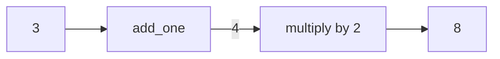

### 5.3 Parallel

Same input to every branch. Output is a dict keyed by branch name.

```python
par = RunnableParallel(
    double=RunnableLambda(lambda x: x * 2),
    square=RunnableLambda(lambda x: x ** 2),
)
par.invoke(4)                          # {'double': 8, 'square': 16}

# A dict literal is coerced to RunnableParallel when piped into a Runnable.
mixed = {"a": add_one, "b": RunnablePassthrough()} | RunnableLambda(
    lambda d: d["a"] + d["b"]
)
mixed.invoke(10)                       # 21  (a=11, b=10)
```

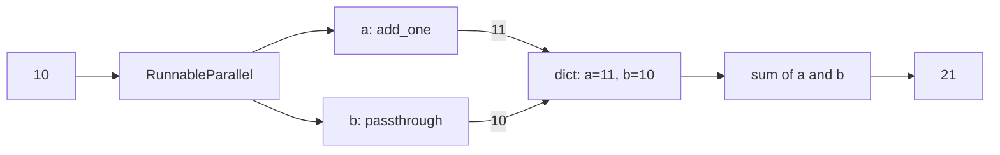

### 5.4 Passthrough, assign, pick, map

```python
# Keep input, add keys.
RunnablePassthrough.assign(n=lambda d: len(d["text"])).invoke({"text": "hello"})
# {'text': 'hello', 'n': 5}

# Select keys.
RunnableLambda(lambda d: d).pick("a").invoke({"a": 1, "b": 2})                  # 1
RunnableLambda(lambda d: d).pick(["a", "b"]).invoke({"a": 1, "b": 2, "c": 3})
# {'a': 1, 'b': 2}

# Lift a runnable over a list.
add_one.map().invoke([1, 2, 3])        # [2, 3, 4]
```

---

## 6. Level 2: components, streaming, routing, modifiers

Shared setup for sections 6 and 7:

```python
import asyncio
from typing import Any, Iterator, Optional
from langchain_core.runnables import (
    Runnable, RunnableLambda, RunnableParallel, RunnablePassthrough,
    RunnableGenerator, RunnableBranch, RunnableConfig, ConfigurableField, chain,
)
from langchain_core.language_models.fake_chat_models import FakeListChatModel
from langchain_core.output_parsers import StrOutputParser
from langchain_core.prompts import ChatPromptTemplate

add_one = RunnableLambda(lambda x: x + 1)
model = FakeListChatModel(responses=["hello world"])   # streams per character
```

### 6.1 Prompt, model, parser

```python
prompt = ChatPromptTemplate.from_template("Summarize: {text}")
chain_ = prompt | model | StrOutputParser()

chain_.invoke({"text": "..."})                 # 'hello world'
list(chain_.stream({"text": "..."}))           # ['h','e','l','l','o',' ',...]
chain_.batch([{"text": "a"}, {"text": "b"}], config={"max_concurrency": 2})

# Results arrive in completion order, tagged with input index.
list(add_one.batch_as_completed([1, 2, 3]))
# e.g. [(0, 2), (2, 4), (1, 3)]
```

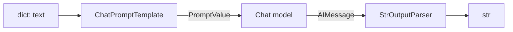

### 6.2 RunnableGenerator: chunk-preserving transform

```python
# The function receives an ITERATOR of upstream chunks, not a single value.
def upper_stream(chunks: Iterator[str]) -> Iterator[str]:
    for c in chunks:
        yield c.upper()

g = RunnableGenerator(upper_stream)
list(g.stream("ab"))      # ['AB']   (a plain input is wrapped as one chunk)
g.invoke("ab")            # 'AB'     (invoke concatenates the output chunks)

# Chunk-wise streaming survives through the generator.
streaming = model | StrOutputParser() | g
list(streaming.stream("x"))   # ['H','E','L','L','O',' ','W','O','R','L','D']
```

Streaming behavior by step type:

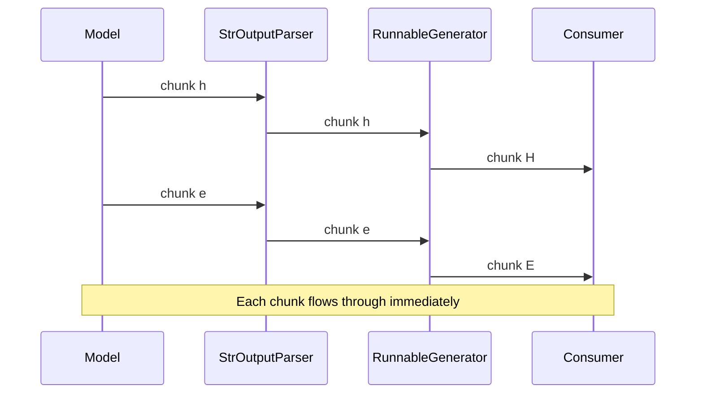

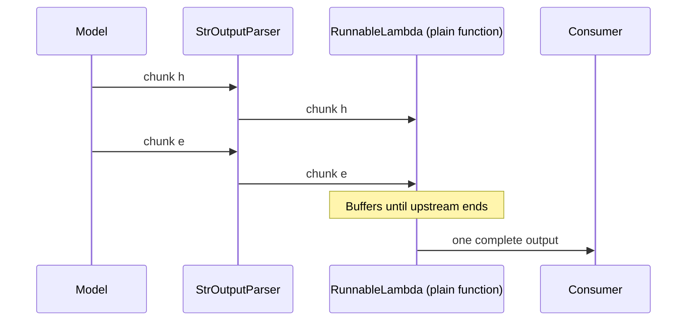

### 6.3 Routing

```python
# Declarative: ordered (condition, runnable) pairs plus a default.
branch = RunnableBranch(
    (lambda x: isinstance(x, int), RunnableLambda(lambda x: f"int:{x}")),
    (lambda x: isinstance(x, str), RunnableLambda(lambda x: f"str:{x}")),
    RunnableLambda(lambda x: "other"),
)
branch.invoke(1)       # 'int:1'
branch.invoke("a")     # 'str:a'
branch.invoke(1.5)     # 'other'

# Dynamic: a RunnableLambda that RETURNS a Runnable. The returned runnable is
# executed with the same config.
def route(x):
    return add_one if x > 0 else RunnableLambda(lambda v: 0)

RunnableLambda(route).invoke(5)    # 6
RunnableLambda(route).invoke(-5)   # 0

# Key-based dispatch.
from langchain_core.runnables.router import RouterRunnable
rr = RouterRunnable({"inc": add_one, "neg": RunnableLambda(lambda x: -x)})
rr.invoke({"key": "neg", "input": 5})   # -5
```

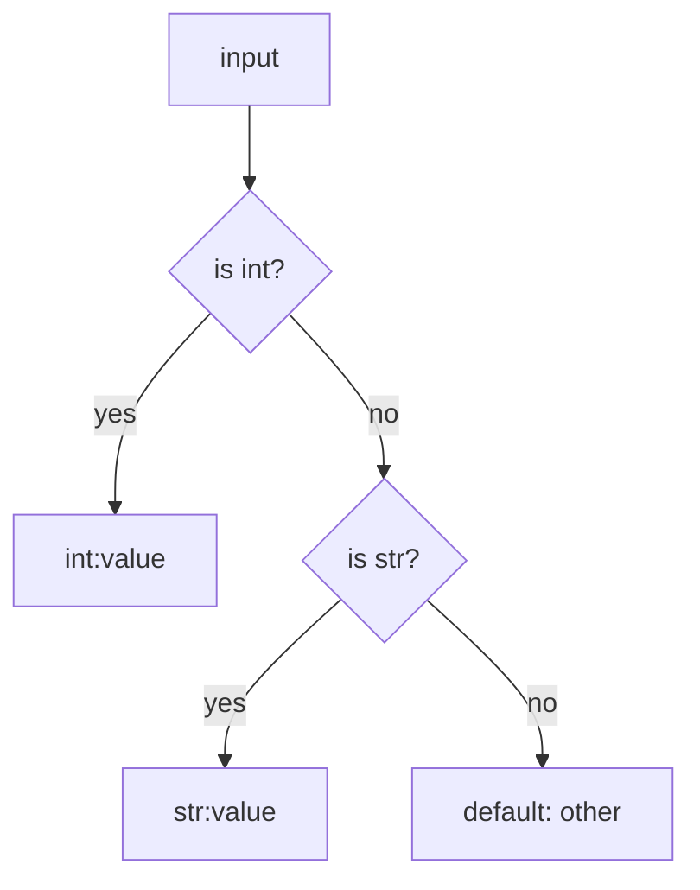

### 6.4 `@chain` decorator

```python
# Imperative control flow, still a Runnable (RunnableLambda).
@chain
def pipeline(x: int):
    return add_one.invoke(x) * 10

pipeline.invoke(1)     # 20
```

### 6.5 Modifiers

#### Retry

Re-executes the whole wrapped runnable on exception.

```python
calls = {"n": 0}
def flaky(x):
    calls["n"] += 1
    if calls["n"] < 3:
        raise ValueError("fail")
    return x

r = RunnableLambda(flaky).with_retry(stop_after_attempt=3, wait_exponential_jitter=False)
type(r).__name__       # 'RunnableRetry'
r.invoke("ok")         # 'ok'  (calls["n"] == 3)
```

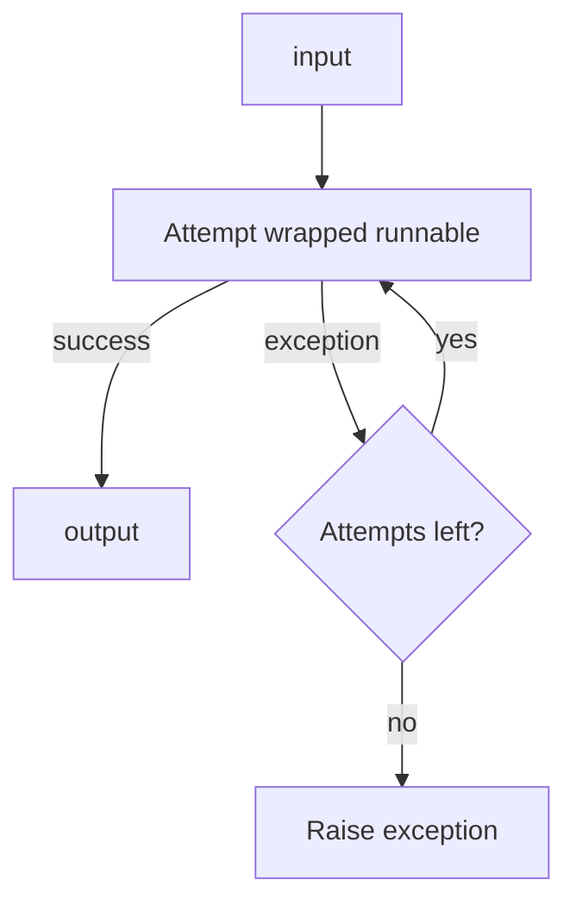

#### Fallbacks

Ordered alternatives on exception.

```python
def bad(x): raise RuntimeError("bad")

fb = RunnableLambda(bad).with_fallbacks([RunnableLambda(lambda x: "fallback")])
fb.invoke(1)           # 'fallback'

# Restrict which exceptions trigger the fallback. Others propagate.
fb2 = RunnableLambda(bad).with_fallbacks(
    [RunnableLambda(lambda x: "fb")], exceptions_to_handle=(ValueError,)
)
# fb2.invoke(1) -> raises RuntimeError
```

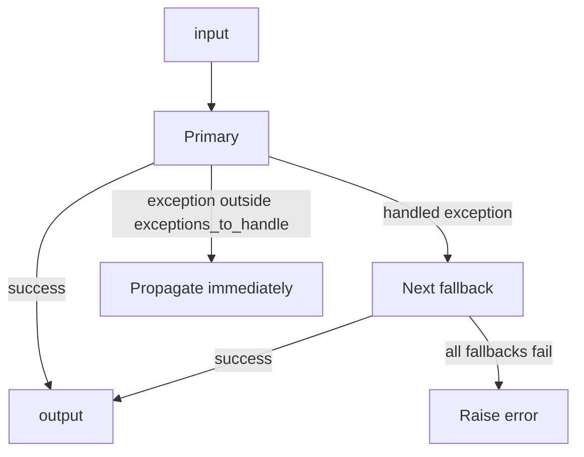

#### Bind

Pre-set kwargs forwarded to the wrapped runnable.

```python
def kw(x, **kwargs): return (x, kwargs)
RunnableLambda(kw).bind(flag=True).invoke(1)    # (1, {'flag': True})
```

#### Config injection and propagation

```python
# Declare a `config` parameter to receive RunnableConfig.
def with_cfg(x, config: RunnableConfig):
    return (x, config.get("tags"), config.get("metadata"))

RunnableLambda(with_cfg).invoke(1, config={"tags": ["t"], "metadata": {"u": 1}})
# (1, ['t'], {'u': 1})
RunnableLambda(with_cfg).with_config(tags=["bound"]).invoke(1)
# (1, ['bound'], {})

# Forward config when invoking runnables inside a function.
def outer(x, config: RunnableConfig):
    return add_one.invoke(x, config)    # keeps callbacks, tags, tracing linked
```

#### Types, schema, listeners

```python
t = RunnableLambda(lambda x: x).with_types(input_type=int, output_type=int)
t.input_schema.model_json_schema()
# {'title': 'RunnableLambdaInput', 'type': 'integer'}

# Listeners: hooks receiving the Run object.
def on_start(run): print("start", run.name)
def on_end(run):   print("end", run.name)
add_one.with_listeners(on_start=on_start, on_end=on_end).invoke(1)
# start RunnableLambda / end RunnableLambda -> 2
```

### 6.6 Runtime configurability

```python
# Expose a constructor field as a runtime knob.
m = FakeListChatModel(responses=["a"]).configurable_fields(
    responses=ConfigurableField(id="resp", name="resp")
)
m.invoke("x").content                                                # 'a'
m.with_config(configurable={"resp": ["b"]}).invoke("x").content      # 'b'

# Swap whole implementations at runtime.
alt = FakeListChatModel(responses=["A"]).configurable_alternatives(
    ConfigurableField(id="llm"),
    default_key="a",
    b=FakeListChatModel(responses=["B"]),
)
alt.invoke("x").content                                              # 'A'
alt.with_config(configurable={"llm": "b"}).invoke("x").content       # 'B'
```

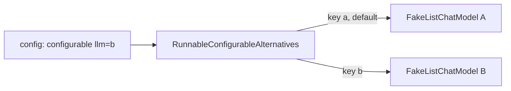

### 6.7 Event stream and graph

```python
async def main():
    ch = model | StrOutputParser()

    # Every nested step emits start, stream, and end events.
    events = {e["event"] async for e in ch.astream_events("x", version="v2")}
    print(sorted(events))
    # ['on_chain_end','on_chain_start','on_chain_stream',
    #  'on_chat_model_end','on_chat_model_start','on_chat_model_stream',
    #  'on_parser_end','on_parser_start','on_parser_stream']

    async for chunk in ch.astream("x"):
        print(repr(chunk), end=" ")        # 'h' 'e' 'l' 'l' 'o' ...

    print(await ch.abatch(["a", "b"]))     # ['hello world', 'hello world']

asyncio.run(main())

# Graph export. draw_mermaid() has no extra dependency.
# draw_ascii() requires `pip install grandalf`.
mixed = {"a": add_one, "b": RunnablePassthrough()} | RunnableLambda(
    lambda d: d["a"] + d["b"]
)
print(mixed.get_graph().draw_mermaid())
```

---

## 7. Level 3: custom runnables and a full pipeline

### 7.1 Custom `Runnable` subclass

```python
class Clamp(Runnable[float, float]):
    """Only `invoke` is implemented. batch, stream, ainvoke are inherited."""

    def __init__(self, lo: float, hi: float):
        self.lo, self.hi = lo, hi

    def invoke(
        self,
        input: float,
        config: Optional[RunnableConfig] = None,
        **kwargs: Any,
    ) -> float:
        return max(self.lo, min(self.hi, input))

c = Clamp(0, 10)
c.invoke(15)                         # 10
c.batch([-1, 5, 11])                 # [0, 5, 10]
list(c.stream(99))                   # [10]
asyncio.run(c.ainvoke(-3))           # 0
(c | RunnableLambda(lambda x: x * 2)).invoke(50)   # 20  (composes like any Runnable)
```

For serialization and `configurable_*` support on a custom class, subclass `RunnableSerializable` (Pydantic-based) instead.

### 7.2 Triage pipeline

Combines `assign`, parallel retrieval, routing, retry, callbacks, batch, and stream.

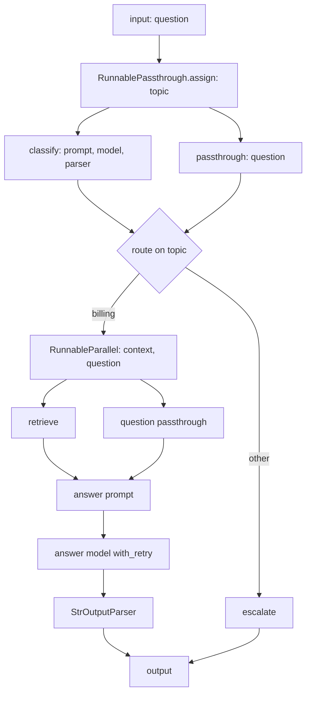

```python
from langchain_core.callbacks import BaseCallbackHandler

classifier   = FakeListChatModel(responses=["billing"])
answer_model = FakeListChatModel(responses=["Refund issued."])

def retrieve(q: str) -> list[str]:
    return [f"doc about {q}"]

# Step A: classify. Prompt -> model -> string.
classify = (
    ChatPromptTemplate.from_template("Classify: {question}")
    | classifier
    | StrOutputParser()
)

# Step B: billing branch. Parallel context retrieval + question passthrough,
# then prompt -> retrying model -> parser.
answer_prompt = ChatPromptTemplate.from_messages([
    ("system", "Context: {context}"),
    ("human", "{question}"),
])
billing_chain = (
    RunnableParallel(
        context=RunnableLambda(lambda d: d["question"]) | RunnableLambda(retrieve),
        question=lambda d: d["question"],        # callable coerced to RunnableLambda
    )
    | answer_prompt
    | answer_model.with_retry(stop_after_attempt=2)
    | StrOutputParser()
)

# Step C: route on the classification. Returning a Runnable executes it.
def route(d: dict):
    if d["topic"].strip().lower() == "billing":
        return billing_chain
    return RunnableLambda(lambda d: "escalate")

# Step D: assemble. assign() keeps the input and adds `topic`.
triage = (
    RunnablePassthrough.assign(topic=classify) | RunnableLambda(route)
).with_config(run_name="triage", tags=["demo"])
```

Callback handler attached once at the top reaches every nested step:

```python
class Counter(BaseCallbackHandler):
    def __init__(self): self.starts = []
    def on_chain_start(self, serialized, inputs, **kw): self.starts.append(kw.get("name"))
    def on_chat_model_start(self, serialized, messages, **kw): self.starts.append("chat_model")

h = Counter()
triage.invoke({"question": "Where is my refund?"}, config={"callbacks": [h]})
# 'Refund issued.'
h.starts
# ['triage', 'RunnableAssign<topic>', 'RunnableParallel<topic>', 'RunnableSequence',
#  'ChatPromptTemplate', 'chat_model', 'StrOutputParser', 'route', 'RunnableSequence',
#  'RunnableParallel<context,question>', ... 'ChatPromptTemplate',
#  'FakeListChatModel', 'chat_model', 'StrOutputParser']

triage.batch([{"question": "a"}, {"question": "b"}])   # ['Refund issued.', 'Refund issued.']
list(triage.stream({"question": "Where is my refund?"}))[:4]
# ['R', 'e', 'f', 'u']   streaming propagates through the routed sub-chain
```

---

## 8. Behavioral rules

All verified by execution unless marked otherwise.

| Rule | Detail |
|---|---|
| Streaming is a property of every step | Non-streaming components emit one chunk. A plain-function `RunnableLambda` consumes its full upstream input before emitting, which ends chunk-wise streaming at that point. `RunnableGenerator` preserves it |
| Dict coercion requires a Runnable operand | `{"a": f} \| g` works when `g` is a Runnable. `dict \| dict` is Python's dict merge and yields a plain dict |
| Config does not propagate through plain function calls | Declare a `config` parameter and pass it to inner `.invoke(...)` calls to keep callbacks, tags, and tracing linked. On Python 3.10 and below, async context propagation also requires explicit passing (documented behavior, not executed here) |
| `with_config(tags=...)` merges | `with_config(run_name=...)` changes the trace name only. `get_name()` still returns the class name |
| `batch_as_completed` ordering | Completion order. Use the returned index to reassemble |
| `with_retry` scope | Re-executes the entire wrapped runnable. Side-effecting steps inside it must be idempotent |
| `.assign()` and `.pick()` on an instance | Return `RunnableSequence` (`self \| RunnableAssign(...)`). `RunnablePassthrough.assign(...)` returns `RunnableAssign` directly |
| `draw_ascii()` | Requires `grandalf`. `draw_mermaid()` has no extra dependency |
| Message history | `RunnableWithMessageHistory` and `InMemoryChatMessageHistory` emit deprecation warnings in 1.6.x. Conversation state belongs in LangGraph checkpointers |

---

## 9. Lookup tables

### 9.1 Method to returned class

| Expression | Returns |
|---|---|
| `a \| b` | `RunnableSequence` |
| `{"k": a} \| b` | `RunnableSequence` (dict becomes `RunnableParallel`) |
| `RunnablePassthrough.assign(k=fn)` | `RunnableAssign` |
| `a.assign(k=fn)` | `RunnableSequence` |
| `a.pick("k")` | `RunnableSequence` |
| `a.map()` | `RunnableEach` |
| `a.bind(...)` | `RunnableBinding` |
| `a.with_config(...)` | `RunnableBinding` |
| `a.with_types(...)` | `RunnableBinding` |
| `a.with_listeners(...)` | `RunnableBinding` |
| `a.with_retry(...)` | `RunnableRetry` |
| `a.with_fallbacks([...])` | `RunnableWithFallbacks` |
| `a.configurable_fields(...)` | `RunnableConfigurableFields` |
| `a.configurable_alternatives(...)` | `RunnableConfigurableAlternatives` |
| `@chain` on a function | `RunnableLambda` |

### 9.2 Requirement to construct

| Requirement | Construct |
|---|---|
| Serial steps | `a \| b` |
| Concurrent steps on the same input | `RunnableParallel` or dict literal |
| Add a key, keep the input | `RunnablePassthrough.assign(...)` |
| Select keys | `.pick(...)` |
| Wrap a function | `RunnableLambda`, `@chain` |
| Custom step that preserves chunk streaming | `RunnableGenerator` |
| Conditional route, declarative | `RunnableBranch` |
| Conditional route, dynamic | `RunnableLambda` returning a Runnable |
| Key-based dispatch | `RouterRunnable` |
| Apply over a list | `.map()` |
| Retry on exception | `.with_retry(...)` |
| Alternative on exception | `.with_fallbacks([...])` |
| Runtime-tunable parameter | `.configurable_fields(...)` |
| Runtime-swappable implementation | `.configurable_alternatives(...)` |
| Pre-set call kwargs | `.bind(...)` |
| Run hooks | `.with_listeners(...)` or `callbacks` in config |
| Custom class | Subclass `Runnable`. Subclass `RunnableSerializable` for serialization and `configurable_*` |

---
