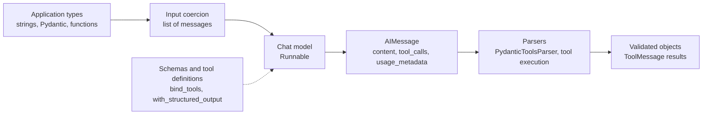
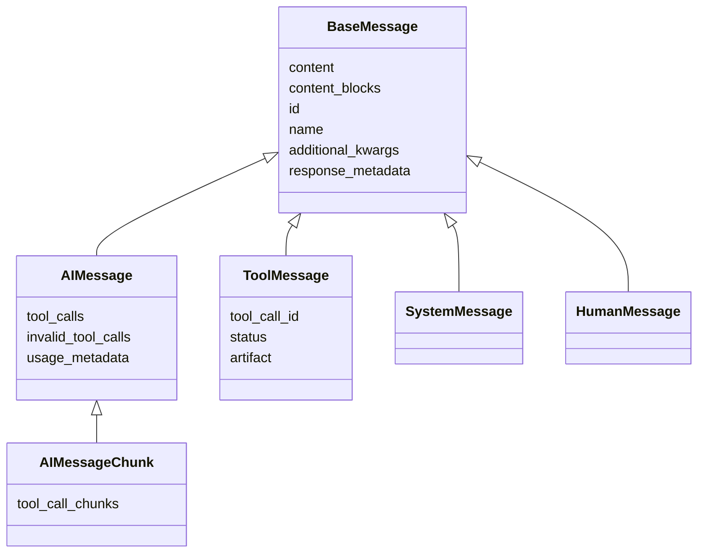
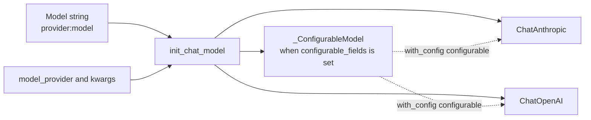
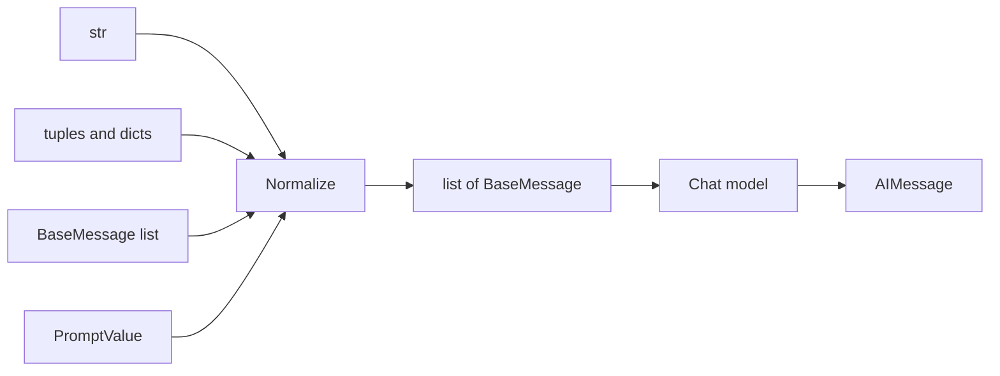
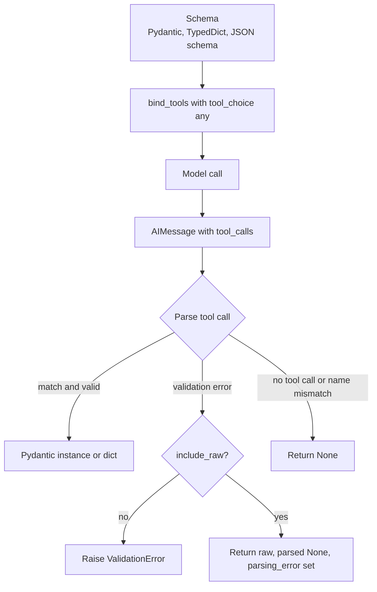
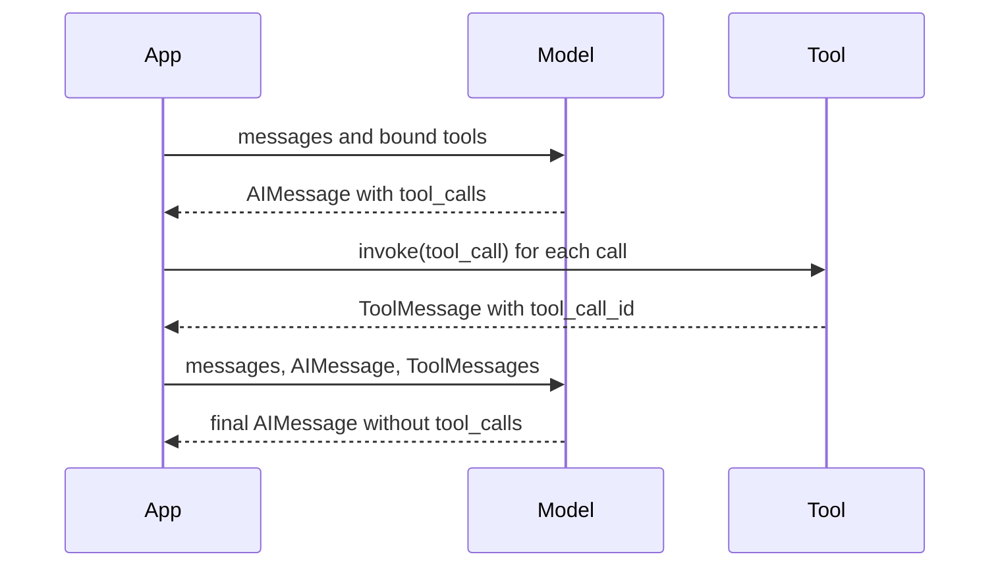
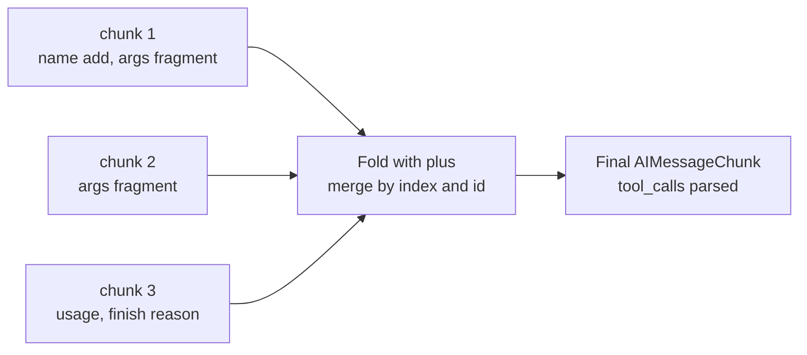
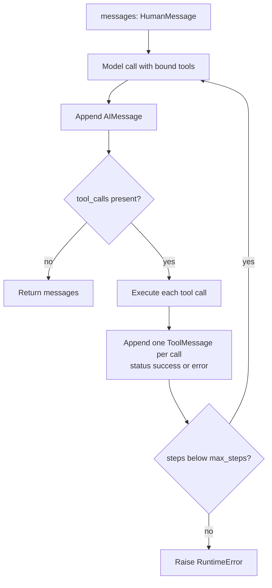
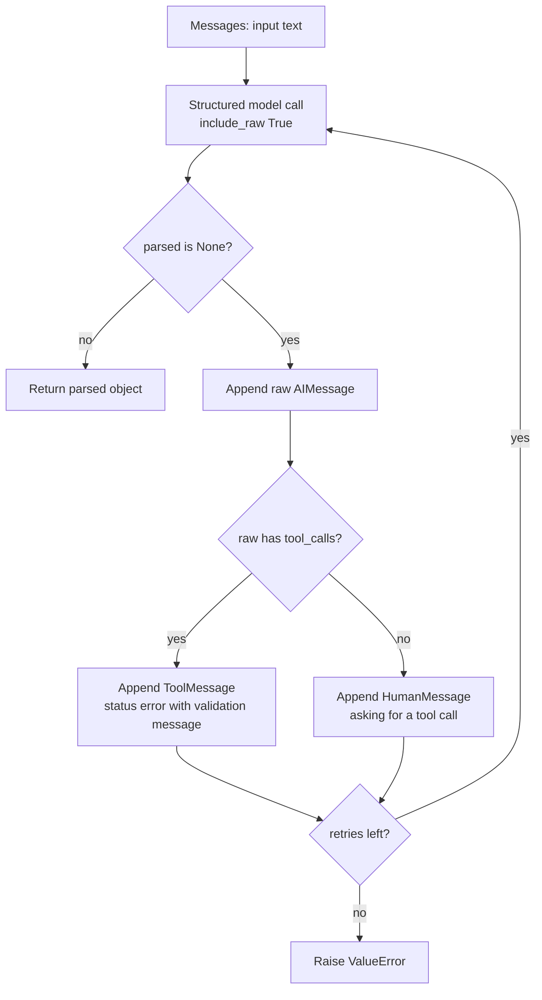

<!-- markdownlint-disable MD001 -->
<!-- markdownlint-disable MD012 -->
<!-- markdownlint-disable MD022 -->
<!-- markdownlint-disable MD024 -->
<!-- markdownlint-disable MD025 -->
<!-- markdownlint-disable MD026 -->
<!-- markdownlint-disable MD029 -->
<!-- markdownlint-disable MD040 -->
<!-- markdownlint-disable MD056 -->
<!-- markdownlint-disable MD060 -->

# LangChain Typed Model Boundary: Reference

- Scope: messages, model initialization, the chat model as a `Runnable`, structured output, tool calling at the model level, failure modes.
- Prerequisite: the `Runnable` interface (see `langchain_runnable_interface.md`).
- Verified versions: `langchain-core 1.6.6`, `langchain 1.4.3`, `langchain-anthropic 1.7.5`, `langchain-openai 1.6.7`, `pydantic 2.13.5` (October 2026).
- Progression: Level 1 (messages, plain invocation), Level 2 (structured output, tools, init), Level 3 (streaming aggregation, agent loop, repair loop, fallbacks).

## Verification scope

| Area | How it was verified |
|---|---|
| Messages, chunks, utilities, tool-call parsing, structured-output parsing, tool round trip, callbacks, fallbacks | Executed offline against `ScriptedChatModel` (section 2) |
| `init_chat_model`, `ChatAnthropic`, `ChatOpenAI` construction, `bind_tools` payloads, `with_structured_output` signatures | Executed offline. Objects were constructed with dummy keys. No network call was made |
| Real provider generation (actual model output, provider-side schema enforcement, real `finish_reason` or `stop_reason` values) | Not executed. Marked "documented behavior, not executed" where it appears |

Model identifiers go stale. Confirm names against provider documentation before use.

## Contents

1. [Definition: the boundary](#1-definition-the-boundary)
2. [Offline test harness](#2-offline-test-harness)
3. [Messages](#3-messages)
4. [Model initialization](#4-model-initialization)
5. [The model as a Runnable](#5-the-model-as-a-runnable)
6. [Structured output](#6-structured-output)
7. [Tool calling at the model level](#7-tool-calling-at-the-model-level)
8. [Level 3: streaming aggregation, agent loop, repair loop, fallbacks](#8-level-3-streaming-aggregation-agent-loop-repair-loop-fallbacks)
9. [Failure modes](#9-failure-modes)
10. [Lookup tables](#10-lookup-tables)

---

## 1. Definition: the boundary

A chat model is a `Runnable` with a fixed typed contract: a message sequence goes in, one `AIMessage` comes out (`AIMessageChunk` when streaming).  
The model itself is an unreliable function.  
The boundary around it is what makes it usable: typed messages on the way in, schemas and tool definitions sent to the model, validated objects and parsed tool calls on the way out.



Three contracts cross this boundary:

| Contract | Direction | Carrier |
|---|---|---|
| Conversation | application to model, model to application | `BaseMessage` subclasses |
| Output shape | application to model (schema), model to application (data) | `with_structured_output` |
| Actions | application to model (tool schemas), model to application (tool calls), application to model (tool results) | `bind_tools`, `AIMessage.tool_calls`, `ToolMessage` |

---

## 2. Offline test harness

`BaseChatModel` is abstract. Subclassing it with prepared responses gives deterministic runs without an API key.  
It also records every call, so tests can assert exactly what crossed the boundary.  
Built-in fake models do not implement `bind_tools`, so they cannot demonstrate structured output or tool calling. This harness does.

```python
from typing import Annotated, Any, TypedDict
from pydantic import BaseModel, Field
from langchain_core.language_models.chat_models import BaseChatModel
from langchain_core.messages import (
    AIMessage, AIMessageChunk, HumanMessage, SystemMessage, ToolMessage,
)
from langchain_core.outputs import ChatGeneration, ChatGenerationChunk, ChatResult
from langchain_core.tools import tool
from langchain_core.utils.function_calling import convert_to_openai_tool


class ScriptedChatModel(BaseChatModel):
    """Offline model. Returns prepared AIMessages in order and records every call."""
    script: list[AIMessage]
    calls: list = []
    cursor: int = 0

    @property
    def _llm_type(self) -> str:
        return "scripted"

    def _generate(self, messages, stop=None, run_manager=None, **kwargs):
        # Record what crossed the boundary: input messages and bound kwargs.
        self.calls.append({"messages": messages, "kwargs": kwargs})
        msg = self.script[self.cursor % len(self.script)]
        self.cursor += 1
        return ChatResult(generations=[ChatGeneration(message=msg)])

    def bind_tools(self, tools, *, tool_choice=None, **kwargs):
        # Implementing this is what enables with_structured_output on the base class.
        formatted = [convert_to_openai_tool(t) for t in tools]
        return self.bind(tools=formatted, tool_choice=tool_choice, **kwargs)


def tc(name: str, args: dict, id_: str) -> dict:
    """Shorthand for one tool call entry."""
    return {"name": name, "args": args, "id": id_, "type": "tool_call"}
```

All later sections assume this block has been executed.

---

## 3. Messages

### 3.1 Types



| Type | `type` value | Role |
|---|---|---|
| `SystemMessage` | `system` | Instructions to the model |
| `HumanMessage` | `human` | User input. Supports multimodal content blocks |
| `AIMessage` | `ai` | Model output. Carries `tool_calls`, `invalid_tool_calls`, `usage_metadata` |
| `ToolMessage` | `tool` | Result of one tool call. Linked by `tool_call_id` |
| `AIMessageChunk` | `AIMessageChunk` | One streamed fragment. Supports `+` aggregation |

### 3.2 Fields

| Field | Meaning |
|---|---|
| `content` | `str` or a list of content blocks. Provider-shaped |
| `content_blocks` | Standardized view of `content`: a list of typed blocks (`text`, `image`, `tool_call`, ...) |
| `id`, `name` | Optional identifiers |
| `additional_kwargs` | Provider-specific extras |
| `response_metadata` | Provider response data (finish reason, model name, ...) |
| `usage_metadata` | `input_tokens`, `output_tokens`, `total_tokens` (plus optional detail dicts) |
| `tool_calls` | Parsed tool calls: `name`, `args` (dict), `id`, `type` |
| `invalid_tool_calls` | Tool calls whose arguments failed to parse. Carries the raw `args` string and an `error` |
| `tool_call_chunks` | Streamed tool-call fragments (`args` as partial string, `index`) |

### 3.3 Construction and inspection

```python
msgs = [
    SystemMessage("You are terse."),
    HumanMessage("Hi", name="alice", id="h1"),
    AIMessage("Hello", usage_metadata={"input_tokens": 5, "output_tokens": 2, "total_tokens": 7}),
]
[(type(m).__name__, m.type, m.content, m.id, m.name) for m in msgs]
# [('SystemMessage', 'system', 'You are terse.', None, None),
#  ('HumanMessage', 'human', 'Hi', 'h1', 'alice'),
#  ('AIMessage', 'ai', 'Hello', None, None)]

msgs[2].usage_metadata
# {'input_tokens': 5, 'output_tokens': 2, 'total_tokens': 7}

msgs[2].content_blocks
# [{'type': 'text', 'text': 'Hello'}]

# Multimodal input: content is a list of blocks.
HumanMessage(content=[
    {"type": "text", "text": "hi"},
    {"type": "image", "url": "http://x/y.png"},
]).content_blocks
# [{'type': 'text', 'text': 'hi'}, {'type': 'image', 'url': 'http://x/y.png'}]
```

### 3.4 Coercion to typed messages

```python
from langchain_core.messages import convert_to_messages

convert_to_messages([
    ("system", "s"),
    ("human", "h"),
    {"role": "assistant", "content": "a"},
])
# [SystemMessage(content='s'), HumanMessage(content='h'), AIMessage(content='a', tool_calls=[], invalid_tool_calls=[])]
```

### 3.5 Tool-call fields on `AIMessage` and `ToolMessage`

```python
ai = AIMessage(content="", tool_calls=[tc("add", {"a": 1, "b": 2}, "call_1")])
ai.tool_calls            # [{'name': 'add', 'args': {'a': 1, 'b': 2}, 'id': 'call_1', 'type': 'tool_call'}]
ai.invalid_tool_calls    # []
ai.content_blocks        # [{'type': 'tool_call', 'id': 'call_1', 'name': 'add', 'args': {'a': 1, 'b': 2}}]

tm = ToolMessage(content="3", tool_call_id="call_1", name="add")
tm.type, tm.tool_call_id, tm.status, tm.artifact
# ('tool', 'call_1', 'success', None)

# Arguments that failed JSON parsing land in a separate list. tool_calls stays empty.
bad = AIMessage(content="", invalid_tool_calls=[
    {"name": "add", "args": '{"a": ', "id": "c2", "error": "bad json", "type": "invalid_tool_call"}
])
bad.tool_calls           # []
bad.invalid_tool_calls   # [{'type': 'invalid_tool_call', 'id': 'c2', 'name': 'add', 'args': '{"a": ', 'error': 'bad json'}]
```

### 3.6 Chunk aggregation

Streamed fragments combine with `+`.  
Text concatenates. Usage metadata sums.  
Tool-call fragments merge by `index` and `id`, and `tool_calls` is parsed from the combined argument string.

```python
c1 = AIMessageChunk(content="Hel")
c2 = AIMessageChunk(content="lo", usage_metadata={"input_tokens": 3, "output_tokens": 2, "total_tokens": 5})
agg = c1 + c2
type(agg).__name__, agg.content, agg.usage_metadata
# ('AIMessageChunk', 'Hello', {'input_tokens': 3, 'output_tokens': 2, 'total_tokens': 5})

t1 = AIMessageChunk(content="", tool_call_chunks=[{"name": "add", "args": '{"a": ', "id": "c1", "index": 0}])
t2 = AIMessageChunk(content="", tool_call_chunks=[{"name": None, "args": '1, "b": 2}', "id": None, "index": 0}])
(t1 + t2).tool_calls
# [{'name': 'add', 'args': {'a': 1, 'b': 2}, 'id': 'c1', 'type': 'tool_call'}]
(t1 + t2).tool_call_chunks
# [{'name': 'add', 'args': '{"a": 1, "b": 2}', 'id': 'c1', 'index': 0, 'type': 'tool_call_chunk'}]
```

### 3.7 Message utilities

```python
from langchain_core.messages import trim_messages, filter_messages, merge_message_runs, message_to_dict

long = [SystemMessage("s"), HumanMessage("one two three"), AIMessage("four five"), HumanMessage("six")]

# Trim by budget. token_counter=len counts messages, not tokens.
trim_messages(long, max_tokens=2, token_counter=len, strategy="last", include_system=True)
# [SystemMessage('s'), HumanMessage('six')]

# Filter by type.
filter_messages(long, include_types=["human"])
# [HumanMessage('one two three'), HumanMessage('six')]

# Merge consecutive messages of the same type. Contents join with a newline.
merge_message_runs([HumanMessage("a"), HumanMessage("b")])
# [HumanMessage('a\nb')]

# Serialize.
message_to_dict(msgs[1])
# {'type': 'human', 'data': {'content': 'Hi', ..., 'type': 'human', 'name': 'alice', 'id': 'h1'}}
```

---

## 4. Model initialization

`init_chat_model` (package `langchain`, module `langchain.chat_models`) builds a provider chat model from a string.  
Provider packages (`langchain-anthropic`, `langchain-openai`, ...) must be installed.  
Credentials come from environment variables or keyword arguments.

```python
from langchain.chat_models import init_chat_model

# "provider:model" string.
a = init_chat_model("anthropic:claude-sonnet-4-6", temperature=0, max_tokens=256)
type(a).__name__, a.model, a.temperature, a.max_tokens
# ('ChatAnthropic', 'claude-sonnet-4-6', 0.0, 256)

# Provider as keyword.
o = init_chat_model("gpt-4.1-mini", model_provider="openai", timeout=10, max_retries=1)
type(o).__name__, o.model_name, o.request_timeout, o.max_retries
# ('ChatOpenAI', 'gpt-4.1-mini', 10.0, 1)

# Runtime-configurable model. Fields become overridable through config.
d = init_chat_model(configurable_fields="any", config_prefix="llm")
type(d).__name__    # '_ConfigurableModel'
d2 = d.with_config(configurable={"llm_model": "anthropic:claude-sonnet-4-6", "llm_temperature": 0})
# Same Runnable surface. The concrete model is resolved per call.
```

Signature:

```text
init_chat_model(model=None, *, model_provider=None, configurable_fields=None,
                config_prefix=None, **kwargs) -> BaseChatModel | _ConfigurableModel
```

Common constructor parameters:

| Parameter | Effect |
|---|---|
| `temperature` | Sampling randomness |
| `max_tokens` | Output cap. Hitting it truncates the response |
| `timeout` | Per-request timeout. Stored as `request_timeout` on `ChatOpenAI` |
| `max_retries` | Client-level retry count, separate from `Runnable.with_retry` |



---

## 5. The model as a Runnable

`BaseChatModel` is a `Runnable[LanguageModelInput, AIMessage]`.  
Everything from the Runnable reference applies: `invoke`, `stream`, `batch`, `|`, `.bind`, `.with_retry`, `.with_fallbacks`, `.with_config`, `astream_events`.

### 5.1 Input coercion

| Input | Becomes |
|---|---|
| `str` | One `HumanMessage` |
| `list` of `BaseMessage` | Used as is |
| `list` of `(role, content)` tuples | Typed messages |
| `list` of `{"role", "content"}` dicts | Typed messages |
| `PromptValue` (prompt template output) | `.to_messages()` |



```python
m = ScriptedChatModel(script=[
    AIMessage("pong", usage_metadata={"input_tokens": 3, "output_tokens": 1, "total_tokens": 4})
])

r = m.invoke("ping")
type(r).__name__, r.content, r.usage_metadata
# ('AIMessage', 'pong', {'input_tokens': 3, 'output_tokens': 1, 'total_tokens': 4})
[type(x).__name__ for x in m.calls[-1]["messages"]]       # ['HumanMessage']

m.invoke([("system", "s"), ("human", "h")])
[type(x).__name__ for x in m.calls[-1]["messages"]]       # ['SystemMessage', 'HumanMessage']

m.invoke([HumanMessage("x")]).content                     # 'pong'
```

### 5.2 Streaming default

A model that does not implement `_stream` yields one complete message.  
Providers that stream yield `AIMessageChunk` objects (documented behavior, not executed against a real provider; aggregation is exercised in section 8.1).

```python
chunks = list(m.stream("x"))
len(chunks), type(chunks[0]).__name__      # (1, 'AIMessage')
```

### 5.3 Token accounting

`get_usage_metadata_callback` aggregates `usage_metadata` per model name.  
The key is `response_metadata["model_name"]`. A message without it is skipped.

```python
from langchain_core.callbacks import get_usage_metadata_callback

um = ScriptedChatModel(script=[AIMessage(
    "a",
    usage_metadata={"input_tokens": 3, "output_tokens": 1, "total_tokens": 4},
    response_metadata={"model_name": "scripted-1"},
)])
with get_usage_metadata_callback() as cb:
    um.invoke("x")
    um.invoke("y")
cb.usage_metadata
# {'scripted-1': {'input_tokens': 6, 'output_tokens': 2, 'total_tokens': 8}}
```

---

## 6. Structured output

`model.with_structured_output(schema)` returns a `Runnable` that accepts the same inputs as the model and returns typed data.

### 6.1 Mechanism (default tool-calling method)

The base class implementation binds the schema as a tool with `tool_choice="any"`, then parses the resulting tool call.  
It raises `NotImplementedError` when the model does not implement `bind_tools` (per source, not executed).



### 6.2 Schema types

| Schema | Output | Validated |
|---|---|---|
| Pydantic class | Instance of the class | Yes |
| `TypedDict` | `dict` | No |
| JSON schema `dict` | `dict` | No |

```python
class Person(BaseModel):
    """A person."""
    name: str = Field(description="full name")
    age: int

m2 = ScriptedChatModel(script=[AIMessage("", tool_calls=[tc("Person", {"name": "Ada", "age": 36}, "c1")])])

# Pydantic
m2.with_structured_output(Person).invoke("Ada is 36")
# Person(name='Ada', age=36)

# What crossed the boundary
m2.calls[-1]["kwargs"]["tool_choice"]      # 'any'
m2.calls[-1]["kwargs"]["tools"][0]
# {'type': 'function',
#  'function': {'name': 'Person', 'description': 'A person.',
#               'parameters': {'properties': {'name': {'description': 'full name', 'type': 'string'},
#                                             'age': {'type': 'integer'}},
#                              'required': ['name', 'age'], 'type': 'object'}}}

# TypedDict. The tool name is the class name.
class PersonTD(TypedDict):
    """A person."""
    name: Annotated[str, ..., "full name"]
    age: Annotated[int, ..., "age in years"]

td_model = ScriptedChatModel(script=[AIMessage("", tool_calls=[tc("PersonTD", {"name": "Ada", "age": 36}, "c1")])])
td_model.with_structured_output(PersonTD).invoke("x")
# {'name': 'Ada', 'age': 36}

# JSON schema dict. The tool name is the schema "title".
schema = {
    "title": "Person", "description": "A person.", "type": "object",
    "properties": {"name": {"type": "string"}, "age": {"type": "integer"}},
    "required": ["name", "age"],
}
m2.with_structured_output(schema).invoke("x")
# {'name': 'Ada', 'age': 36}
```

### 6.3 `include_raw`

`include_raw=True` returns a dict with `raw` (the `AIMessage`), `parsed`, and `parsing_error`.  
Parse failures are captured instead of raised.

```python
m3 = ScriptedChatModel(script=[AIMessage("", tool_calls=[tc("Person", {"name": "Ada", "age": "not a number"}, "c2")])])

res = m3.with_structured_output(Person, include_raw=True).invoke("x")
set(res)                                   # {'raw', 'parsed', 'parsing_error'}
res["parsed"]                              # None
type(res["parsing_error"]).__name__        # 'ValidationError'

m3.with_structured_output(Person).invoke("x")
# raises pydantic ValidationError
```

### 6.4 Silent `None`

Two conditions return `None` without raising.  
Both occur with the tool-calling method.

```python
# 1. The model answered with text and no tool call.
plain = ScriptedChatModel(script=[AIMessage("plain text")])
plain.with_structured_output(Person).invoke("x")                    # None
r = plain.with_structured_output(Person, include_raw=True).invoke("x")
r["parsed"], r["parsing_error"]                                     # (None, None)

# 2. The tool-call name does not match the schema name (TypedDict and dict schemas).
wrong = ScriptedChatModel(script=[AIMessage("", tool_calls=[tc("Other", {"name": "Ada", "age": 36}, "c1")])])
wrong.with_structured_output(PersonTD).invoke("x")                  # None
```

Rule: treat `None` as a failure. With `include_raw=True`, `parsing_error` stays `None` in these cases, so test `parsed is None`, not `parsing_error`.

### 6.5 Provider methods

Signatures verified by introspection.

| Class | `method` options | Default |
|---|---|---|
| `BaseChatModel` (default implementation) | `method` and `strict` are accepted and ignored. Tool calling only | tool calling |
| `ChatAnthropic` | `function_calling`, `json_schema` | `function_calling` |
| `ChatOpenAI` | `function_calling`, `json_mode`, `json_schema` | `json_schema` |

Additional `ChatOpenAI` parameters: `strict`, `tools`.

Documented behavior, not executed:

| Method | Meaning |
|---|---|
| `function_calling` | Schema sent as a forced tool. Parsed from `tool_calls` |
| `json_schema` | Provider-native constrained decoding against the schema |
| `json_mode` | Valid JSON guaranteed, schema not enforced. The prompt must describe the shape |

```python
o.with_structured_output(Person, method="json_schema")     # RunnableSequence
a.with_structured_output(Person)                           # RunnableSequence
```

---

## 7. Tool calling at the model level

The model never executes a tool. It emits structured requests (`AIMessage.tool_calls`).  
The application executes them and returns `ToolMessage` results.

### 7.1 Tool definition

`@tool` derives the name from the function name, the description from the docstring, and the argument schema from the signature.

```python
@tool
def add(a: int, b: int) -> int:
    """Add two integers."""
    return a + b

add.name, add.description    # ('add', 'Add two integers.')
add.args
# {'a': {'title': 'A', 'type': 'integer'}, 'b': {'title': 'B', 'type': 'integer'}}

convert_to_openai_tool(add)
# {'type': 'function',
#  'function': {'name': 'add', 'description': 'Add two integers.',
#               'parameters': {'properties': {'a': {'type': 'integer'}, 'b': {'type': 'integer'}},
#                              'required': ['a', 'b'], 'type': 'object'}}}
```

### 7.2 `bind_tools` and provider payloads

`bind_tools` returns a `RunnableBinding` that carries the tool schemas and `tool_choice` as call kwargs.  
Each provider translates them into its own wire format. Verified offline by construction.

```python
ab = a.bind_tools([add], tool_choice="any")                  # a = ChatAnthropic from section 4
type(ab).__name__, list(ab.kwargs)                           # ('_ChatModelBinding', ['tools', 'tool_choice'])
ab.kwargs["tool_choice"]                                     # {'type': 'any'}
ab.kwargs["tools"][0]
# {'name': 'add', 'input_schema': {'properties': {'a': {'type': 'integer'}, 'b': {'type': 'integer'}},
#                                   'required': ['a', 'b'], 'type': 'object'},
#  'description': 'Add two integers.'}

ob = o.bind_tools([add], tool_choice="add", parallel_tool_calls=False)   # o = ChatOpenAI from section 4
list(ob.kwargs)                                              # ['tools', 'parallel_tool_calls', 'tool_choice']
ob.kwargs["tool_choice"]                                     # {'type': 'function', 'function': {'name': 'add'}}
ob.kwargs["parallel_tool_calls"]                             # False
```

| Aspect | Anthropic | OpenAI |
|---|---|---|
| Tool schema key | `input_schema` | `function.parameters` |
| `tool_choice="any"` | `{'type': 'any'}` | provider-specific mapping |
| `tool_choice="<tool name>"` | provider-specific mapping | `{'type': 'function', 'function': {'name': ...}}` |
| `parallel_tool_calls` | not exercised here | accepted, forwarded |

`tool_choice` semantics (documented behavior, not executed): `None` or `"auto"` lets the model decide, `"any"` or `"required"` forces some tool call, a tool name forces that tool.

### 7.3 Round trip



```python
m4 = ScriptedChatModel(script=[
    AIMessage("", tool_calls=[tc("add", {"a": 1, "b": 2}, "call_1"),
                              tc("add", {"a": 10, "b": 20}, "call_2")]),
    AIMessage("Results: 3 and 30"),
])
bound = m4.bind_tools([add])

ai = bound.invoke("add things")
len(ai.tool_calls), ai.tool_calls[0]["id"]          # (2, 'call_1')   parallel calls

# tool.invoke(tool_call) returns a ToolMessage linked by tool_call_id.
tool_msgs = [add.invoke(call) for call in ai.tool_calls]
[(type(t).__name__, t.content, t.tool_call_id) for t in tool_msgs]
# [('ToolMessage', '3', 'call_1'), ('ToolMessage', '30', 'call_2')]

# Send the full exchange back.
final = bound.invoke([HumanMessage("add things"), ai, *tool_msgs])
final.content                                        # 'Results: 3 and 30'
[type(x).__name__ for x in m4.calls[-1]["messages"]]
# ['HumanMessage', 'AIMessage', 'ToolMessage', 'ToolMessage']

# A plain arguments dict returns the raw result, not a ToolMessage.
add.invoke({"a": 2, "b": 3})                         # 5
```

### 7.4 Rules

- Every `ToolMessage` must reference the `tool_call_id` of a call in the preceding `AIMessage`.
- The `AIMessage` that contains the tool calls must stay in the history, followed by one `ToolMessage` per call.
- `tool_calls` and `invalid_tool_calls` are separate lists. Check both.

---

## 8. Level 3: streaming aggregation, agent loop, repair loop, fallbacks

### 8.1 Streaming tool calls

A streaming model emits `AIMessageChunk` fragments.  
Folding them with `+` yields the final message, including parsed `tool_calls`, summed `usage_metadata`, and merged `response_metadata`.

```python
class StreamingScriptedModel(ScriptedChatModel):
    chunks: list = []

    def _stream(self, messages, stop=None, run_manager=None, **kwargs):
        for c in self.chunks:
            yield ChatGenerationChunk(message=c)

sm = StreamingScriptedModel(script=[AIMessage("")], chunks=[
    AIMessageChunk(content="", tool_call_chunks=[{"name": "add", "args": '{"a": ', "id": "c1", "index": 0}]),
    AIMessageChunk(content="", tool_call_chunks=[{"name": None, "args": '1, "b": 2}', "id": None, "index": 0}]),
    AIMessageChunk(content="", usage_metadata={"input_tokens": 4, "output_tokens": 6, "total_tokens": 10},
                   response_metadata={"finish_reason": "tool_calls"}),
])

agg = None
for chunk in sm.stream("x"):
    agg = chunk if agg is None else agg + chunk

type(agg).__name__          # 'AIMessageChunk'
agg.tool_calls              # [{'name': 'add', 'args': {'a': 1, 'b': 2}, 'id': 'c1', 'type': 'tool_call'}]
agg.usage_metadata          # {'input_tokens': 4, 'output_tokens': 6, 'total_tokens': 10}
agg.response_metadata       # {'finish_reason': 'tool_calls'}

# Async path aggregates identically.
import asyncio

async def collect():
    out = None
    async for chunk in sm.astream("x"):
        out = chunk if out is None else out + chunk
    return out

asyncio.run(collect()).tool_calls
# [{'name': 'add', 'args': {'a': 1, 'b': 2}, 'id': 'c1', 'type': 'tool_call'}]
```



### 8.2 Manual agent loop

The loop below is the control flow that agent frameworks formalize: model call, tool execution, history update, termination check.  
Tool exceptions and unknown tool names become `ToolMessage(status="error")`, so the model sees the failure instead of the program crashing.



```python
@tool
def boom(x: int) -> int:
    """Always fails."""
    raise ValueError("boom failed")

TOOLS = {t.name: t for t in (add, boom)}

loop_model = ScriptedChatModel(script=[
    AIMessage("", tool_calls=[tc("add", {"a": 1, "b": 2}, "c1"),
                              tc("boom", {"x": 1}, "c2"),
                              tc("missing", {}, "c3")]),
    AIMessage("Done: 3, boom failed, missing unknown"),
])

def run_agent(model, question, max_steps=5):
    bound = model.bind_tools(list(TOOLS.values()))
    messages = [HumanMessage(question)]
    for _ in range(max_steps):
        ai = bound.invoke(messages)
        messages.append(ai)
        if not ai.tool_calls:
            return messages                              # termination: no further tool requests
        for call in ai.tool_calls:
            try:
                messages.append(TOOLS[call["name"]].invoke(call))
            except Exception as e:                       # tool failure or unknown tool name
                messages.append(ToolMessage(
                    content=f"{type(e).__name__}: {e}",
                    tool_call_id=call["id"], name=call["name"], status="error",
                ))
    raise RuntimeError("max steps exceeded")             # guard against non-termination

for m in run_agent(loop_model, "go"):
    print(type(m).__name__, repr(m.content))
# HumanMessage 'go'
# AIMessage ''                                    (tool_calls: add, boom, missing)
# ToolMessage '3'                                 (status success)
# ToolMessage 'ValueError: boom failed'           (status error)
# ToolMessage "KeyError: 'missing'"               (status error)
# AIMessage 'Done: 3, boom failed, missing unknown'
```

### 8.3 Structured-output repair loop

On a parse failure, feed the error back to the model and retry. Uses `include_raw=True` so the failure is data, not an exception.  
Handles both failure shapes: a malformed tool call (reply with an error `ToolMessage`) and no tool call at all (reply with a `HumanMessage`).



```python
repair_model = ScriptedChatModel(script=[
    AIMessage("", tool_calls=[tc("Person", {"name": "Ada", "age": "n/a"}, "r1")]),   # invalid
    AIMessage("", tool_calls=[tc("Person", {"name": "Ada", "age": 36}, "r2")]),      # valid
])

def extract(model, text, retries=2):
    structured = model.with_structured_output(Person, include_raw=True)
    messages = [HumanMessage(text)]
    for attempt in range(retries + 1):
        res = structured.invoke(messages)
        if res["parsed"] is not None:                    # test parsed, not parsing_error (section 6.4)
            return res["parsed"], attempt
        raw, err = res["raw"], res["parsing_error"]
        messages.append(raw)
        if raw.tool_calls:
            messages.append(ToolMessage(
                content=f"Validation error: {err}",
                tool_call_id=raw.tool_calls[0]["id"], status="error",
            ))
        else:
            messages.append(HumanMessage(f"Output was not valid. Error: {err}. Call the tool."))
    raise ValueError("extraction failed")

extract(repair_model, "Ada is 36")
# (Person(name='Ada', age=36), 1)                        succeeded on retry 1
[type(x).__name__ for x in repair_model.calls[-1]["messages"]]
# ['HumanMessage', 'AIMessage', 'ToolMessage']           the history the second attempt saw
```

### 8.4 Prompt, structured model, post-processing in one chain

```python
from langchain_core.prompts import ChatPromptTemplate, MessagesPlaceholder
from langchain_core.runnables import RunnableLambda

prompt = ChatPromptTemplate.from_messages([
    ("system", "Extract a person."),
    MessagesPlaceholder("history", optional=True),
    ("human", "{text}"),
])
cm = ScriptedChatModel(script=[AIMessage("", tool_calls=[tc("Person", {"name": "Bo", "age": 5}, "k1")])])

chain = prompt | cm.with_structured_output(Person) | RunnableLambda(lambda p: p.model_dump())
chain.invoke({"text": "Bo is 5"})
# {'name': 'Bo', 'age': 5}
[type(x).__name__ for x in cm.calls[-1]["messages"]]
# ['SystemMessage', 'HumanMessage']                      optional placeholder omitted when absent
```

### 8.5 Provider fallback

`with_fallbacks` works on models like on any Runnable.

```python
class Boom(ScriptedChatModel):
    def _generate(self, *a, **k):
        raise RuntimeError("provider down")

primary = Boom(script=[AIMessage("x")])
secondary = ScriptedChatModel(script=[AIMessage("from secondary")])
primary.with_fallbacks([secondary]).invoke("x").content
# 'from secondary'
```

---

## 9. Failure modes

| Failure | Observable behavior | Handling |
|---|---|---|
| Schema violation (Pydantic) | `ValidationError`, or `parsed=None` and `parsing_error` set with `include_raw=True` | `include_raw=True` and a repair loop (8.3) |
| Model returned text, no tool call (tool-calling structured output) | Result is `None`. `parsing_error` is also `None` | Test `parsed is None` (6.4) |
| Tool-call name differs from schema name (TypedDict, dict schema) | Result is `None` | Same as above. Keep schema names stable |
| Tool-call arguments are not valid JSON | `tool_calls` empty, `invalid_tool_calls` populated | Inspect both lists. Return an error `ToolMessage` or retry |
| Tool raises an exception | Exception in the application loop | Catch. Return `ToolMessage(status="error")` (8.2) |
| Model requests an unknown tool | Lookup failure in the application loop | Catch. Return `ToolMessage(status="error")` (8.2) |
| Non-terminating tool loop | Unbounded model calls | `max_steps` guard (8.2) |
| Output truncated by `max_tokens` | Finish reason in `response_metadata`. Key name varies by provider (documented behavior, not executed). Structured output or tool-call JSON can be cut off | Check the finish reason. Raise `max_tokens`. Treat as invalid output |
| Provider outage or rate limit | Exception from the model call | `.with_retry(...)`, `.with_fallbacks([...])` (8.5) |
| Missing usage data | `usage_metadata` is `None`. The usage callback skips messages without `response_metadata["model_name"]` | Verify per provider. Do not assume cost accounting is complete |
| Provider divergence | `method` options, `tool_choice` mapping, tool schema shape differ (7.2, 6.5) | Pin provider-specific behavior in tests. Avoid relying on defaults across providers |

---

## 10. Lookup tables

### 10.1 Requirement to construct

| Requirement | Construct |
|---|---|
| Build a provider model from a string | `init_chat_model("provider:model", **kwargs)` |
| Swap model or parameters at runtime | `init_chat_model(configurable_fields=..., config_prefix=...)` or `.configurable_fields(...)` |
| Normalize arbitrary message input | `convert_to_messages(...)` |
| Bound history size | `trim_messages(...)` |
| Fold streamed chunks | `chunk_a + chunk_b` |
| Typed output, validated | `with_structured_output(PydanticClass)` |
| Typed output, unvalidated | `with_structured_output(TypedDictClass)` or JSON schema `dict` |
| Capture parse failures as data | `with_structured_output(..., include_raw=True)` |
| Expose a function to the model | `@tool`, then `bind_tools([...])` |
| Force a tool call | `bind_tools([...], tool_choice="any")` or a tool name |
| Execute a requested call | `tool.invoke(tool_call)` returns `ToolMessage` |
| Report a tool failure to the model | `ToolMessage(..., status="error")` |
| Aggregate token usage | `get_usage_metadata_callback()` |
| Survive provider failure | `.with_retry(...)`, `.with_fallbacks([...])` |
| Deterministic offline tests | `BaseChatModel` subclass with scripted `AIMessage`s (section 2) |

### 10.2 Message fields by origin

| Field | Set by | Consumed by |
|---|---|---|
| `content` of `HumanMessage` or `SystemMessage` | Application | Model |
| `tool_calls` | Model (parsed by the provider integration) | Application tool executor |
| `invalid_tool_calls` | Provider integration | Application error handling |
| `usage_metadata` | Provider integration | Accounting, callbacks |
| `response_metadata` | Provider integration | Diagnostics, truncation checks |
| `tool_call_id`, `status`, `artifact` of `ToolMessage` | Application | Model, next turn |

---
