<!-- markdownlint-disable MD001 -->
<!-- markdownlint-disable MD012 -->
<!-- markdownlint-disable MD022 -->
<!-- markdownlint-disable MD024 -->
<!-- markdownlint-disable MD025 -->
<!-- markdownlint-disable MD026 -->
<!-- markdownlint-disable MD029 -->
<!-- markdownlint-disable MD040 -->
<!-- markdownlint-disable MD056 -->
<!-- markdownlint-disable MD060 -->

# LangChain Tools: Reference

- Scope: defining tools, schemas, invocation, return values, errors, injected arguments, concurrency, observability, resilience, tools inside agents, middleware control, MCP tools, design and security guidance, testing.
- Prerequisites: the `Runnable` interface and the typed model boundary (`langchain_runnable_interface.md`, `langchain_typed_model_boundary.md`).
- Verified versions: `langchain-core 1.6.6`, `langchain 1.4.3`, `langgraph 1.2.13`, `langchain-mcp-adapters 0.3.2`, `mcp 1.30.0`, `pydantic 2.13.5` (October 2026).
- Progression: Level 1 (create and invoke), Level 2 (inputs, outputs, errors, concurrency, resilience), Level 3 (agents, middleware, human approval, MCP, security).

## Verification scope

| Area | How it was verified |
|---|---|
| Tool creation, schemas, invocation, errors, injection, artifacts, concurrency, callbacks, retry, fallbacks | Executed offline |
| `ToolNode`, `create_agent`, `ToolRuntime`, `Command`, middleware, human-in-the-loop | Executed offline against a scripted chat model (section 2) |
| MCP tools | Executed against a local stdio MCP server started as a subprocess |
| Real provider behavior (how a given model chooses tools, argument quality, provider tool-schema limits) | Not executed. Marked "documented behavior, not executed" where it appears |
| `LLMToolSelectorMiddleware`, `LLMToolEmulator`, `ProviderToolSearchMiddleware` | Present in the installed version. Not executed (require a real model) |

## Contents

1. [Definition](#1-definition)
2. [Offline test harness](#2-offline-test-harness)
3. [Level 1: creating tools](#3-level-1-creating-tools)
4. [Level 1: invoking tools and handing them to a model](#4-level-1-invoking-tools-and-handing-them-to-a-model)
5. [Level 2: return values and artifacts](#5-level-2-return-values-and-artifacts)
6. [Level 2: errors](#6-level-2-errors)
7. [Level 2: injected arguments](#7-level-2-injected-arguments)
8. [Level 2: concurrency, observability, resilience](#8-level-2-concurrency-observability-resilience)
9. [Level 3: tools inside agents](#9-level-3-tools-inside-agents)
10. [Level 3: middleware control over tools](#10-level-3-middleware-control-over-tools)
11. [Level 3: MCP tools](#11-level-3-mcp-tools)
12. [Design and security guidance](#12-design-and-security-guidance)
13. [Testing tools](#13-testing-tools)
14. [Failure modes](#14-failure-modes)
15. [Lookup tables](#15-lookup-tables)

---

## 1. Definition

A tool is a callable packaged with three things the model needs: a **name**, a **description**, and an **argument schema**.  
The model never runs the function. It reads the name, description, and schema as prompt material and emits a structured request (a tool call).  
The application executes the request and returns a `ToolMessage`.

`BaseTool` is a `Runnable`.  
Everything from the Runnable reference applies: `invoke`, `ainvoke`, `batch`, `astream_events`, `with_retry`, `with_fallbacks`, `with_config`, callbacks, tracing.

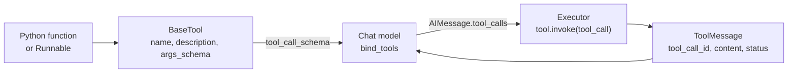

### 1.1 Three audiences

| Audience | Reads | Consequence |
|---|---|---|
| The model | `name`, `description`, `tool_call_schema` | These are prompt text. Quality here determines whether the model picks the tool and fills arguments correctly |
| The application | `args_schema`, return value, exceptions | Validates input, runs the function, converts the result to a `ToolMessage` |
| The framework | Injected-argument markers, `response_format`, `return_direct` | Supplies runtime values the model must not control, routes artifacts, ends agent loops |

### 1.2 Tool attributes

| Attribute | Meaning |
|---|---|
| `name` | Identifier the model emits in `tool_calls` |
| `description` | Natural-language usage guidance sent to the model |
| `args_schema` | Full input schema (Pydantic class or JSON schema). Includes injected arguments |
| `args` | Model-visible argument properties as a dict. Excludes injected arguments |
| `tool_call_schema` | Schema sent to the model. Excludes injected arguments |
| `return_direct` | In an agent, end the loop and return the tool result without another model call |
| `response_format` | `"content"` (default) or `"content_and_artifact"` |
| `handle_tool_error` | How `ToolException` is converted to a result (`True`, `str`, callable, `False`) |
| `handle_validation_error` | Same options for argument validation errors |
| `extras` | Provider-specific or custom metadata passed through to the model integration |

---

## 2. Offline test harness

Agent sections use a scripted chat model: it returns prepared `AIMessage`s in order and records every call.  
No API key is needed. Provider models (`init_chat_model`) replace it in real use.

All later code blocks assume this block has been executed.

```python
import asyncio
import json
import time
from dataclasses import dataclass
from enum import Enum
from typing import Annotated, Any, Literal, Optional, Type

from pydantic import BaseModel, Field, ValidationError, field_validator

from langchain_core.language_models.chat_models import BaseChatModel
from langchain_core.messages import AIMessage, HumanMessage, ToolMessage
from langchain_core.outputs import ChatGeneration, ChatResult
from langchain_core.tools import (
    BaseTool, InjectedToolArg, InjectedToolCallId, StructuredTool, Tool,
    ToolException, tool,
)
from langchain_core.utils.function_calling import convert_to_openai_tool


class ScriptedChatModel(BaseChatModel):
    """Offline model. Returns prepared AIMessages in order and records every call."""
    script: list[AIMessage]
    calls: list = []
    cursor: int = 0

    @property
    def _llm_type(self) -> str:
        return "scripted"

    def _generate(self, messages, stop=None, run_manager=None, **kwargs):
        self.calls.append({"messages": messages, "kwargs": kwargs})
        msg = self.script[self.cursor % len(self.script)]
        self.cursor += 1
        return ChatResult(generations=[ChatGeneration(message=msg)])

    def bind_tools(self, tools, *, tool_choice=None, **kwargs):
        formatted = [convert_to_openai_tool(t) for t in tools]
        return self.bind(tools=formatted, tool_choice=tool_choice, **kwargs)


def tc(name: str, args: dict, id_: str) -> dict:
    """Shorthand for one tool call entry."""
    return {"name": name, "args": args, "id": id_, "type": "tool_call"}
```

---

## 3. Level 1: creating tools

### 3.1 The `@tool` decorator

Name comes from the function name, description from the docstring, schema from the signature and type hints. The result is a `StructuredTool`.

```python
@tool
def add(a: int, b: int) -> int:
    """Add two integers."""
    return a + b

type(add).__name__      # 'StructuredTool'
add.name                # 'add'
add.description         # 'Add two integers.'
add.args
# {'a': {'title': 'A', 'type': 'integer'}, 'b': {'title': 'B', 'type': 'integer'}}
add.tool_call_schema.model_json_schema()
# {'description': 'Add two integers.',
#  'properties': {'a': {'title': 'A', 'type': 'integer'}, 'b': {'title': 'B', 'type': 'integer'}},
#  'required': ['a', 'b'], 'title': 'add', 'type': 'object'}
```

A function without a docstring and without an explicit `description` fails at definition time.

```python
try:
    @tool
    def nodoc(x: int) -> int:
        return x
except ValueError as e:
    print(e)            # Function must have a docstring if description not provided.
```

### 3.2 Customizing the decorator

```python
# Explicit name and description. The docstring is no longer required.
@tool("calc_add", description="Adds numbers. Use for arithmetic.", return_direct=True)
def _add(a: int, b: int) -> int:
    return a + b

_add.name, _add.description, _add.return_direct
# ('calc_add', 'Adds numbers. Use for arithmetic.', True)

# extras: custom or provider-specific metadata carried on the tool.
@tool(extras={"cost": "low", "provider": {"strict": True}})
def with_extras(x: int) -> int:
    """Has extras."""
    return x

with_extras.extras      # {'cost': 'low', 'provider': {'strict': True}}
```

Decorator parameters:

| Parameter | Effect |
|---|---|
| first positional (`name_or_callable`) | Tool name |
| `description` | Overrides the docstring |
| `return_direct` | Agent loop ends after this tool |
| `args_schema` | Explicit Pydantic class or JSON schema |
| `infer_schema` | Derive schema from the signature (default `True`) |
| `response_format` | `"content"` or `"content_and_artifact"` |
| `parse_docstring` | Parse a Google-style docstring into per-argument descriptions |
| `error_on_invalid_docstring` | Raise when `parse_docstring` finds a malformed docstring (default `True`) |
| `extras` | Custom metadata |

### 3.3 Docstring parsing

Without `parse_docstring`, the entire docstring becomes the description, including the `Args:` block.  
With it, the summary becomes the description and each argument description moves into the schema.

```python
@tool
def documented(a: int) -> int:
    """Do a thing.

    Args:
        a: the number
    """
    return a

documented.description
# 'Do a thing.\n\n    Args:\n        a: the number'

@tool(parse_docstring=True)
def search(query: str, limit: int = 5) -> str:
    """Search the catalog.

    Args:
        query: Free-text search string.
        limit: Maximum number of results.
    """
    return f"{query}:{limit}"

search.description      # 'Search the catalog.'
search.args
# {'query': {'description': 'Free-text search string.', 'title': 'Query', 'type': 'string'},
#  'limit': {'default': 5, 'description': 'Maximum number of results.', 'title': 'Limit', 'type': 'integer'}}
```

A malformed docstring raises by default.

```python
try:
    @tool(parse_docstring=True)
    def bad(x: int) -> int:
        """No args section here."""
        return x
except ValueError as e:
    print(e)            # Found invalid Google-Style docstring.
```

### 3.4 Type hints become the schema

```python
class Color(str, Enum):
    red = "red"
    blue = "blue"

class Address(BaseModel):
    city: str
    zip: Optional[str] = None

@tool
def rich(
    name: Annotated[str, "Person name"],
    mode: Literal["fast", "slow"] = "fast",
    color: Color = Color.red,
    tags: list[str] = [],
    nick: Optional[str] = None,
    addr: Optional[Address] = None,
) -> str:
    """Rich signature."""
    return f"{name}|{mode}|{color.value}|{tags}|{nick}|{addr}"

schema = rich.tool_call_schema.model_json_schema()
schema["required"]                    # ['name']
props = schema["properties"]
props["name"]    # {'description': 'Person name', 'title': 'Name', 'type': 'string'}
props["mode"]    # {'default': 'fast', 'enum': ['fast', 'slow'], 'title': 'Mode', 'type': 'string'}
props["color"]   # {'$ref': '#/$defs/Color', 'default': 'red'}
props["tags"]    # {'default': [], 'items': {'type': 'string'}, 'title': 'Tags', 'type': 'array'}
props["nick"]    # {'anyOf': [{'type': 'string'}, {'type': 'null'}], 'default': None, 'title': 'Nick'}
props["addr"]    # {'anyOf': [{'$ref': '#/$defs/Address'}, {'type': 'null'}], 'default': None}

rich.invoke({"name": "x", "mode": "slow", "color": "blue", "tags": ["a"], "addr": {"city": "Paris"}})
# "x|slow|blue|['a']|None|city='Paris' zip=None"
```

| Python type | Schema effect |
|---|---|
| `int`, `str`, `float`, `bool` | Primitive type |
| `Annotated[str, "text"]` | Primitive type plus `description` |
| `Literal["a", "b"]` | `enum` |
| `Enum` subclass | `$ref` to an enum definition. The model sends the value, the function receives the member |
| `list[str]` | `array` with `items` |
| `Optional[X]` | `anyOf` with `null`, default `None` |
| Pydantic `BaseModel` | Nested object under `$defs`. The function receives the instance |
| Default value | `default` in the schema and optional in `required` |

Invocation coerces compatible values and drops unknown keys:

```python
add.invoke({"a": "1", "b": 2})              # 3     string "1" coerced to int
add.invoke({"a": 1, "b": 2, "c": 3})        # 3     unknown key "c" ignored
```

### 3.5 Pydantic `args_schema`

Use a Pydantic class for per-field descriptions, constraints, and validators in one place.

```python
class WeatherInput(BaseModel):
    city: str = Field(description="City name, e.g. 'Paris'")
    units: str = Field(default="c", description="'c' for Celsius or 'f' for Fahrenheit")

    @field_validator("units")
    @classmethod
    def check_units(cls, v: str) -> str:
        if v not in ("c", "f"):
            raise ValueError("units must be 'c' or 'f'")
        return v

@tool("get_weather", args_schema=WeatherInput)
def get_weather(city: str, units: str = "c") -> str:
    """Return the current weather for a city."""
    return f"{city}: 20{units}"

get_weather.args
# {'city': {'description': "City name, e.g. 'Paris'", 'title': 'City', 'type': 'string'},
#  'units': {'default': 'c', 'description': "'c' for Celsius or 'f' for Fahrenheit",
#            'title': 'Units', 'type': 'string'}}
get_weather.invoke({"city": "Paris"})       # 'Paris: 20c'

try:
    get_weather.invoke({"city": "Paris", "units": "k"})
except ValidationError as e:
    print("rejected before the function ran")
```

### 3.6 `StructuredTool.from_function`

Programmatic construction.  
Required when a tool needs both a sync and an async implementation, or when the function is not defined at module level.

```python
def _sync(a: int, b: int) -> int:
    return a + b

async def _async(a: int, b: int) -> int:
    return a + b + 1000           # distinct result to show which path ran

adder = StructuredTool.from_function(
    func=_sync, coroutine=_async, name="adder", description="Add two integers.",
)
adder.invoke({"a": 1, "b": 2})                      # 3     sync path
asyncio.run(adder.ainvoke({"a": 1, "b": 2}))        # 1003  async path
```

### 3.7 Async-only tools

A tool defined only with a coroutine cannot be called synchronously.

```python
@tool
async def aadd(a: int, b: int) -> int:
    """Async add."""
    return a + b

asyncio.run(aadd.ainvoke({"a": 1, "b": 2}))         # 3

try:
    aadd.invoke({"a": 1, "b": 2})
except NotImplementedError as e:
    print(e)            # StructuredTool does not support sync invocation.
```

Rule: provide both `func` and `coroutine` when the tool may run in a sync context.

### 3.8 `BaseTool` subclass

Use when the tool carries state (clients, connections, configuration) or needs full control over execution.

```python
class MultiplyInput(BaseModel):
    a: int = Field(description="first factor")
    b: int = Field(description="second factor")

class Multiply(BaseTool):
    name: str = "multiply"
    description: str = "Multiply two integers."
    args_schema: Type[BaseModel] = MultiplyInput

    def _run(self, a: int, b: int, run_manager=None) -> int:
        return a * b

    async def _arun(self, a: int, b: int, run_manager=None) -> int:
        return a * b

mul = Multiply()
mul.invoke({"a": 3, "b": 4})                        # 12
asyncio.run(mul.ainvoke({"a": 3, "b": 5}))          # 15
mul.args
# {'a': {'description': 'first factor', 'title': 'A', 'type': 'integer'},
#  'b': {'description': 'second factor', 'title': 'B', 'type': 'integer'}}
```

### 3.9 Legacy single-input `Tool`

`Tool` takes a single string. Prefer `StructuredTool` or `@tool` for new code.

```python
legacy = Tool(name="echo", description="Echo the input.", func=lambda s: s)
legacy.invoke("hello")          # 'hello'
legacy.args                     # {'tool_input': {'type': 'string'}}
```

### 3.10 JSON-schema arguments

When the schema comes from outside Python (a registry, a config file, another service), pass it directly and disable inference.  
The function receives the arguments as keyword arguments.

```python
json_schema = {
    "title": "search", "description": "Search things.", "type": "object",
    "properties": {"q": {"type": "string"}}, "required": ["q"],
}

def _search(**kwargs):
    return f"q={kwargs['q']}"

dyn = StructuredTool.from_function(
    func=_search, name="search", description="Search things.",
    args_schema=json_schema, infer_schema=False,
)
dyn.args                        # {'q': {'type': 'string'}}
dyn.invoke({"q": "x"})          # 'q=x'
```

### 3.11 Runnables as tools

Any `Runnable` becomes a tool with `as_tool` (beta API, emits `LangChainBetaWarning`).  
The runnable must accept a dict. Provide the argument types, or an `args_schema`.

```python
from langchain_core.runnables import RunnableLambda

double = RunnableLambda(lambda x: x["a"] * 2).as_tool(
    name="double", description="Double the number a.", arg_types={"a": int},
)
type(double).__name__           # 'StructuredTool'
double.args                     # {'a': {'title': 'A', 'type': 'integer'}}
double.invoke({"a": 4})         # 8
```

A full chain, with a Pydantic schema for the argument:

```python
from langchain_core.output_parsers import StrOutputParser
from langchain_core.prompts import ChatPromptTemplate

class SummarizeInput(BaseModel):
    text: str = Field(description="text to summarize")

summarizer = ChatPromptTemplate.from_template("Summarize: {text}") \
    | ScriptedChatModel(script=[AIMessage("short")]) \
    | StrOutputParser()

summarize_tool = summarizer.as_tool(
    name="summarize", description="Summarize text.", args_schema=SummarizeInput,
)
summarize_tool.args             # {'text': {'description': 'text to summarize', 'title': 'Text', 'type': 'string'}}
summarize_tool.invoke({"text": "long text"})        # 'short'
```

The decorator also accepts a runnable as the second argument:

```python
triple = tool("triple", RunnableLambda(lambda x: x["a"] * 3).with_types(input_type=dict))
type(triple).__name__, triple.name      # ('StructuredTool', 'triple')
```

### 3.12 Retriever as a tool

`create_retriever_tool` wraps a retriever.  
The model supplies a `query` string.  
The tool returns the retrieved documents' text joined by blank lines.

```python
from langchain_core.documents import Document
from langchain_core.embeddings import DeterministicFakeEmbedding
from langchain_core.tools import create_retriever_tool
from langchain_core.vectorstores import InMemoryVectorStore

store = InMemoryVectorStore(DeterministicFakeEmbedding(size=32))   # fake embeddings: ordering is arbitrary
store.add_documents([
    Document(page_content="Refunds take 5 days.", metadata={"src": "faq"}),
    Document(page_content="Shipping is free over $50.", metadata={"src": "faq"}),
    Document(page_content="Support hours are 9 to 5.", metadata={"src": "hours"}),
])

search_docs = create_retriever_tool(
    store.as_retriever(search_kwargs={"k": 2}),
    name="search_docs",
    description="Search the support documentation.",
)
search_docs.args
# {'query': {'description': 'query to look up in retriever', 'title': 'Query', 'type': 'string'}}
out = search_docs.invoke({"query": "refund"})
type(out).__name__              # 'str'     two documents joined by a blank line
```

### 3.13 Toolkits

`BaseToolkit` groups related tools behind `get_tools()`.  
It is an organizational convention, not a runtime construct.

```python
from langchain_core.tools import BaseToolkit

class MathToolkit(BaseToolkit):
    def get_tools(self):
        return [add, mul]

[t.name for t in MathToolkit().get_tools()]        # ['add', 'multiply']
```

### 3.14 Choosing a constructor

| Situation | Use |
|---|---|
| Plain function, default schema | `@tool` |
| Per-field descriptions and validation | `@tool(args_schema=PydanticClass)` or `parse_docstring=True` |
| Both sync and async implementations | `StructuredTool.from_function(func=..., coroutine=...)` |
| Schema defined outside Python | `StructuredTool.from_function(..., args_schema=json_schema, infer_schema=False)` |
| Stateful tool (client, connection) | `BaseTool` subclass |
| Existing chain or runnable | `.as_tool(...)` |
| Retrieval | `create_retriever_tool(...)` |
| Tools from an MCP server | `langchain-mcp-adapters` (section 11) |

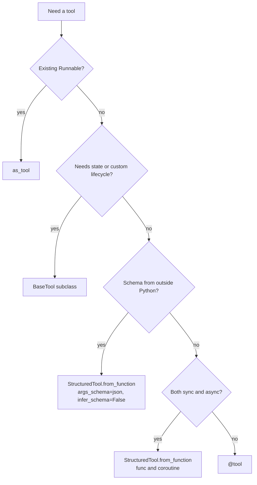

---

## 4. Level 1: invoking tools and handing them to a model

### 4.1 Invocation forms

The return type depends on the input form.

| Input | Output |
|---|---|
| Arguments `dict` | The function's raw return value |
| Tool-call `dict` (`name`, `args`, `id`, `type="tool_call"`) | `ToolMessage` with `tool_call_id`, `name`, `status` |
| Plain `str` | The raw return value (single-argument tools) |

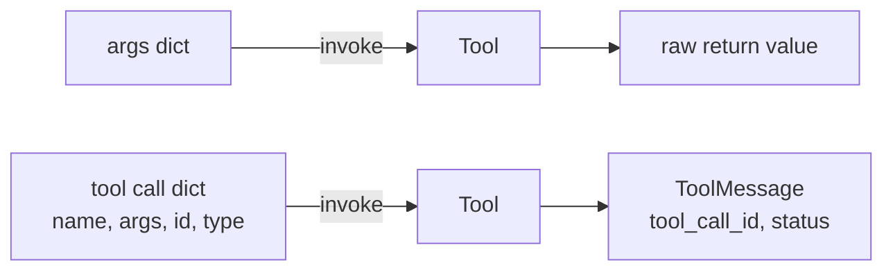

```python
add.invoke({"a": 1, "b": 2})                        # 3

call = tc("add", {"a": 1, "b": 2}, "call_1")
msg = add.invoke(call)
(type(msg).__name__, msg.content, msg.tool_call_id, msg.name, msg.status)
# ('ToolMessage', '3', 'call_1', 'add', 'success')

add.batch([{"a": 1, "b": 2}, {"a": 3, "b": 4}])     # [3, 7]
asyncio.run(add.ainvoke({"a": 5, "b": 6}))          # 11

@tool
def shout(text: str) -> str:
    """Uppercase text."""
    return text.upper()

shout.invoke("hi")                                  # 'HI'
```

A helper used in later sections:

```python
def run_call(t, args: dict, id_: str = "c1") -> ToolMessage:
    """Invoke a tool the way an agent does: with a full tool call."""
    return t.invoke(tc(t.name, args, id_))
```

### 4.2 Handing tools to a model

`convert_to_openai_tool` shows the schema a model integration receives. `bind_tools` attaches tools to a model call.  
The model answers with `tool_calls`.  
The application executes each call and returns the results.

```python
convert_to_openai_tool(add)
# {'type': 'function',
#  'function': {'name': 'add', 'description': 'Add two integers.',
#               'parameters': {'properties': {'a': {'type': 'integer'}, 'b': {'type': 'integer'}},
#                              'required': ['a', 'b'], 'type': 'object'}}}

model = ScriptedChatModel(script=[
    AIMessage("", tool_calls=[tc("add", {"a": 1, "b": 2}, "call_1")]),
    AIMessage("The sum is 3."),
])
bound = model.bind_tools([add])

ai = bound.invoke("What is 1 + 2?")
ai.tool_calls
# [{'name': 'add', 'args': {'a': 1, 'b': 2}, 'id': 'call_1', 'type': 'tool_call'}]

results = [add.invoke(c) for c in ai.tool_calls]
final = bound.invoke([HumanMessage("What is 1 + 2?"), ai, *results])
final.content                                       # 'The sum is 3.'
```

### 4.3 Dispatching by name

With several tools, build a registry and route each call by `name`.

```python
@tool
def negate(x: int) -> int:
    """Negate an integer."""
    return -x

registry = {t.name: t for t in (add, negate)}

calls = [tc("add", {"a": 2, "b": 3}, "k1"), tc("negate", {"x": 7}, "k2")]
[(m.tool_call_id, m.content) for m in (registry[c["name"]].invoke(c) for c in calls)]
# [('k1', '5'), ('k2', '-7')]
```

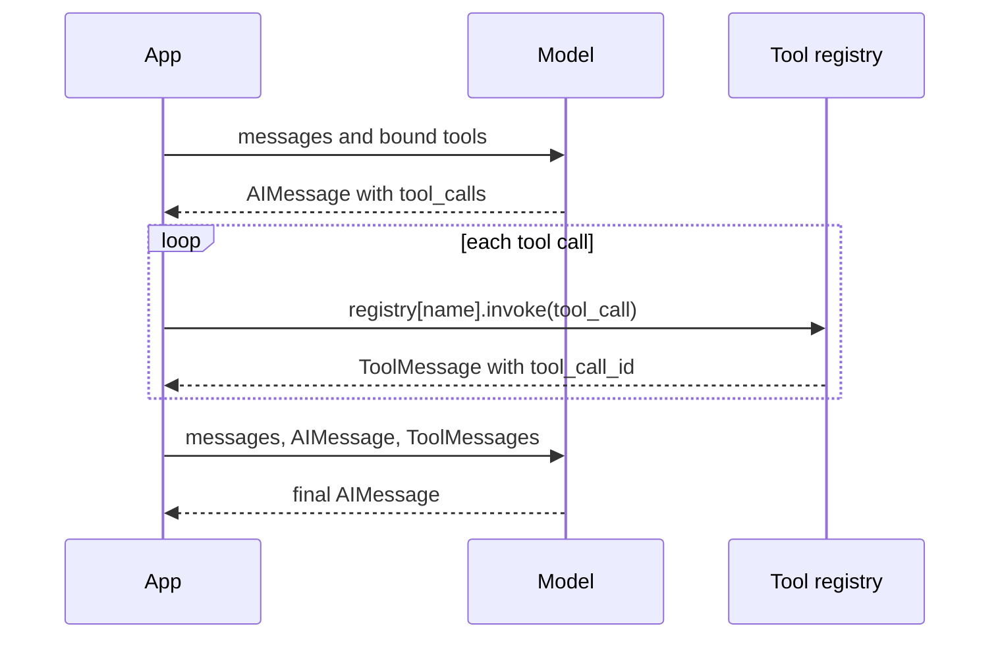

---

## 5. Level 2: return values and artifacts

### 5.1 Return value to message content

A tool invoked with a tool call returns a `ToolMessage`. Its `content` is derived from the function's return value.

| Function returns | `ToolMessage.content` |
|---|---|
| `str` | The string |
| `int`, `float` | String form (`3` becomes `'3'`) |
| `dict` | JSON string |
| `list` | JSON string |
| `None` | `'null'` |
| List of content blocks | The list, unchanged |
| `ToolMessage` | Returned as is |

```python
@tool
def as_dict(x: int) -> dict:
    """Return a dict."""
    return {"x": x, "ok": True}

@tool
def as_list(x: int) -> list:
    """Return a list."""
    return [x, x + 1]

@tool
def as_none(x: int) -> None:
    """Return nothing."""
    return None

@tool
def as_blocks(x: int):
    """Return content blocks."""
    return [{"type": "text", "text": f"value {x}"}]

run_call(as_dict, {"x": 1}).content        # '{"x": 1, "ok": true}'
run_call(as_list, {"x": 1}).content        # '[1, 2]'
run_call(as_none, {"x": 1}).content        # 'null'
run_call(as_blocks, {"x": 1}).content      # [{'type': 'text', 'text': 'value 1'}]
```

Rule: return values the model must read as text or JSON. Format them deliberately.  
A model reads `'null'` as a literal value, not as "no result".

### 5.2 Content and artifact

`response_format="content_and_artifact"` splits the return value into two parts: `content` (sent to the model) and `artifact` (kept on the `ToolMessage`, not sent to the model by default).  
Use it for large or non-textual payloads the application needs but the model does not: raw rows, files, DataFrames, retrieved documents.

The function returns a `(content, artifact)` tuple.

```python
@tool(response_format="content_and_artifact")
def fetch_rows(table: str) -> tuple[str, list[dict]]:
    """Fetch rows from a table. The model sees a summary. The application keeps the rows."""
    rows = [{"id": 1}, {"id": 2}]
    return f"{len(rows)} rows from {table}", rows

fetch_rows.invoke({"table": "users"})
# '2 rows from users'       invoking with plain args returns the content only

msg = run_call(fetch_rows, {"table": "users"})
(msg.content, msg.artifact)
# ('2 rows from users', [{'id': 1}, {'id': 2}])
```

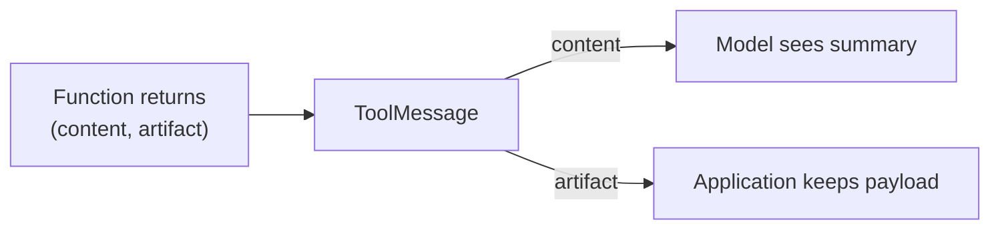

---

## 6. Level 2: errors

### 6.1 Error sources

| Source | Default behavior of `tool.invoke` |
|---|---|
| Arguments fail schema validation | Raises `ValidationError`. Same for an args dict and a tool call |
| Function raises `ToolException` | Raises, unless `handle_tool_error` is set |
| Function raises any other exception | Always propagates, even when `handle_tool_error=True` |

```python
@tool
def risky(x: int) -> int:
    """Fails for negative numbers."""
    if x < 0:
        raise ValueError("negative not allowed")
    return x

try:
    risky.invoke({"x": -1})
except ValueError as e:
    print(e)                                    # negative not allowed

try:
    run_call(add, {"a": "not a number", "b": 1})
except ValidationError:
    print("validation error raised, even for a full tool call")
```

### 6.2 `handle_tool_error`

Applies to `ToolException` only. Options:

| Value | Result |
|---|---|
| `False` (default) | `ToolException` propagates |
| `True` | The exception message becomes the result |
| `str` | The fixed string becomes the result |
| callable | `callable(exception)` becomes the result |

With a tool call as input, the handled result is a `ToolMessage(status="error")`.

```python
def positive_only(x: int) -> int:
    if x < 0:
        raise ToolException("negative not allowed")
    return x

def make(handle):
    return StructuredTool.from_function(
        positive_only, name="positive_only", description="Fails for negatives.",
        handle_tool_error=handle,
    )

make(True).invoke({"x": -1})                            # 'negative not allowed'
make("custom message").invoke({"x": -1})                # 'custom message'
make(lambda e: f"handled: {e}").invoke({"x": -1})       # 'handled: negative not allowed'

try:
    make(False).invoke({"x": -1})
except ToolException:
    print("ToolException propagated")

msg = run_call(make(True), {"x": -1})
(type(msg).__name__, msg.status, msg.content)
# ('ToolMessage', 'error', 'negative not allowed')

# A plain exception is not a ToolException. It propagates even with handle_tool_error=True.
def plain_failure(x: int) -> int:
    raise ValueError("plain failure")

t = StructuredTool.from_function(plain_failure, name="pf", description="pf", handle_tool_error=True)
try:
    t.invoke({"x": 1})
except ValueError:
    print("ValueError propagated")
```

The decorator does not accept `handle_tool_error`. Set the attribute after creation:

```python
@tool
def lookup(key: str) -> str:
    """Look up a key."""
    if key != "known":
        raise ToolException(f"unknown key: {key}")
    return "value"

lookup.handle_tool_error = True
lookup.invoke({"key": "other"})                         # 'unknown key: other'
```

### 6.3 `handle_validation_error`

Same options, applied to argument validation errors.

```python
validated = StructuredTool.from_function(
    lambda a, b: a + b, name="v", description="Add.",
    args_schema=MultiplyInput, handle_validation_error=True,
)
validated.invoke({"a": "x", "b": 2})                    # 'Tool input validation error'

custom = StructuredTool.from_function(
    lambda a, b: a + b, name="v2", description="Add.",
    args_schema=MultiplyInput,
    handle_validation_error=lambda e: "bad arguments, retry with integers",
)
custom.invoke({"a": "x", "b": 2})                       # 'bad arguments, retry with integers'

msg = run_call(validated, {"a": "x", "b": 2})
(msg.status, msg.content)                               # ('error', 'Tool input validation error')
```

### 6.4 Decision flow

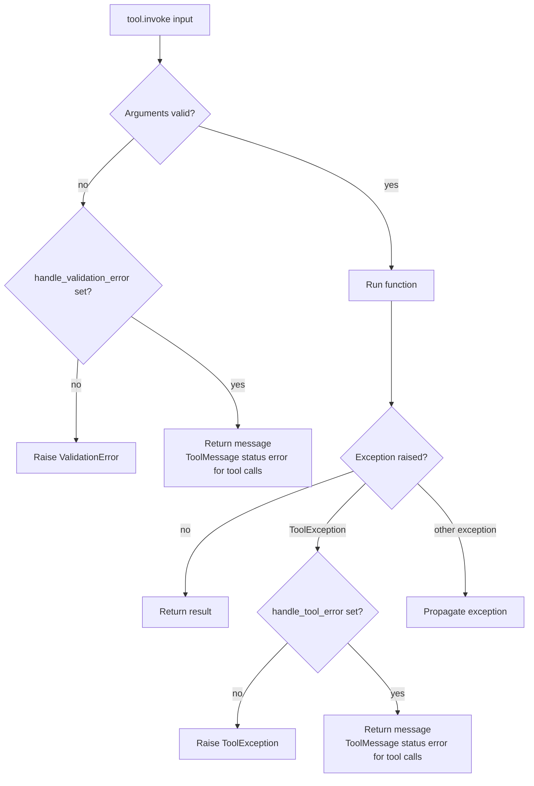

### 6.5 Choosing the exception type

| Situation | Raise | Reason |
|---|---|---|
| The model can fix it by changing arguments (not found, out of range, bad format) | `ToolException` with an actionable message | The model reads the message and retries |
| Programming error, infrastructure failure, unexpected state | Plain exception | Should not be disguised as a model mistake. Handle with retry or middleware (section 10) |

Error messages returned to the model are prompt text. State what failed and what to change. Do not include stack traces, credentials, or internal paths.

---

## 7. Level 2: injected arguments

Some arguments must come from the application, not from the model: the authenticated user, a tenant ID, a database handle, the current tool-call ID.  
Marking them as injected removes them from the schema the model sees.  

### 7.1 `InjectedToolArg`

```python
@tool
def send_email_as_user(to: str, body: str, user_id: Annotated[str, InjectedToolArg]) -> str:
    """Send an email on behalf of the current user."""
    return f"sent to {to} as {user_id}"

list(send_email_as_user.tool_call_schema.model_json_schema()["properties"])    # ['to', 'body']   model-visible
list(send_email_as_user.args)                                                  # ['to', 'body']
list(send_email_as_user.get_input_jsonschema()["properties"])                  # ['to', 'body', 'user_id']   full input

send_email_as_user.invoke({"to": "a@b.c", "body": "hi", "user_id": "u1"})      # 'sent to a@b.c as u1'

try:
    send_email_as_user.invoke({"to": "a@b.c", "body": "hi"})
except ValidationError:
    print("injected argument is required at invocation")
```

The application supplies the value before executing the call. Overwrite unconditionally.  
A model can still emit a `user_id` key in its call, because the schema it saw merely omitted the field.

```python
trusted_user = "u42"

model_call = tc("send_email_as_user", {"to": "x@y.z", "body": "hello", "user_id": "attacker"}, "c6")
model_call["args"]["user_id"] = trusted_user            # overwrite whatever the model sent
send_email_as_user.invoke(model_call).content
# 'sent to x@y.z as u42'
```

### 7.2 `InjectedToolCallId`

Injects the ID of the current tool call. The tool must be invoked with a full tool call.  
A plain args dict fails.

```python
@tool
def log_call(msg: str, call_id: Annotated[str, InjectedToolCallId]) -> str:
    """Log a message."""
    return f"{call_id}:{msg}"

list(log_call.tool_call_schema.model_json_schema()["properties"])      # ['msg']
run_call(log_call, {"msg": "m"}, id_="call_77").content               # 'call_77:m'

try:
    log_call.invoke({"msg": "m"})
except ValueError as e:
    print(e)    # When tool includes an InjectedToolCallId argument, tool must always be invoked with a full model ToolCall...
```

Typical use: return a `ToolMessage` yourself, which requires the matching ID.

```python
@tool
def custom_message(x: int, tool_call_id: Annotated[str, InjectedToolCallId]) -> ToolMessage:
    """Return a hand-built ToolMessage with an artifact."""
    return ToolMessage(content=f"x={x}", tool_call_id=tool_call_id, name="custom_message", artifact={"raw": x})

msg = run_call(custom_message, {"x": 3}, id_="cm1")
(type(msg).__name__, msg.content, msg.artifact)
# ('ToolMessage', 'x=3', {'raw': 3})
```

Inside an agent, `ToolRuntime` replaces both markers and adds state, context, and store access (section 9.3).

---

## 8. Level 2: concurrency, observability, resilience

### 8.1 Concurrency

`batch` runs inputs concurrently on a thread pool. `max_concurrency` in config bounds it.

```python
@tool
def slow(x: int) -> int:
    """Sleep, then return the input."""
    time.sleep(0.2)
    return x

inputs = [{"x": i} for i in range(4)]

t0 = time.time(); slow.batch(inputs)
round(time.time() - t0, 1)                              # 0.2   four calls in parallel

t0 = time.time(); slow.batch(inputs, config={"max_concurrency": 1})
round(time.time() - t0, 1)                              # 0.8   serialized
```

Async tools run concurrently with `asyncio.gather`.

```python
@tool
async def aslow(x: int) -> int:
    """Async sleep, then return the input."""
    await asyncio.sleep(0.2)
    return x

async def gather_all():
    t0 = time.time()
    out = await asyncio.gather(*[aslow.ainvoke({"x": i}) for i in range(4)])
    return out, round(time.time() - t0, 1)

asyncio.run(gather_all())                               # ([0, 1, 2, 3], 0.2)
```

Rule: tools requested together by one `AIMessage` are independent by construction.  
Do not write tools that depend on execution order among parallel calls.  
Side-effecting tools that conflict must serialize (lock, queue, or `max_concurrency=1`).

### 8.2 Callbacks and events

Tools emit `on_tool_start`, `on_tool_end`, `on_tool_error` to callback handlers, and the same events through `astream_events`.

```python
from langchain_core.callbacks import BaseCallbackHandler

class Recorder(BaseCallbackHandler):
    def __init__(self):
        self.events = []
    def on_tool_start(self, serialized, input_str, **kwargs):
        self.events.append(("start", serialized.get("name"), kwargs.get("inputs")))
    def on_tool_end(self, output, **kwargs):
        self.events.append(("end", getattr(output, "content", output)))
    def on_tool_error(self, error, **kwargs):
        self.events.append(("error", type(error).__name__))

rec = Recorder()
add.invoke({"a": 1, "b": 2}, config={"callbacks": [rec], "tags": ["demo"], "run_name": "my_add"})
rec.events
# [('start', 'add', {'a': 1, 'b': 2}), ('end', 3)]

rec2 = Recorder()
add.invoke(tc("add", {"a": 1, "b": 2}, "z"), config={"callbacks": [rec2]})
rec2.events
# [('start', 'add', {'a': 1, 'b': 2}), ('end', '3')]       a tool call reports the ToolMessage content

async def event_names():
    return [e["event"] async for e in add.astream_events({"a": 1, "b": 2}, version="v2")]

asyncio.run(event_names())                              # ['on_tool_start', 'on_tool_end']
```

### 8.3 Retry

Tools are Runnables, so `.with_retry()` applies.  
Restrict retries to transient exception types.  
A retry re-executes the entire function: the tool must be idempotent.

```python
attempts = {"n": 0}

@tool
def flaky(x: int) -> int:
    """Fails twice, then succeeds."""
    attempts["n"] += 1
    if attempts["n"] < 3:
        raise ConnectionError("transient")
    return x

resilient = flaky.with_retry(
    stop_after_attempt=3, wait_exponential_jitter=False,
    retry_if_exception_type=(ConnectionError,),
)
resilient.invoke({"x": 5})                              # 5
attempts                                                # {'n': 3}
```

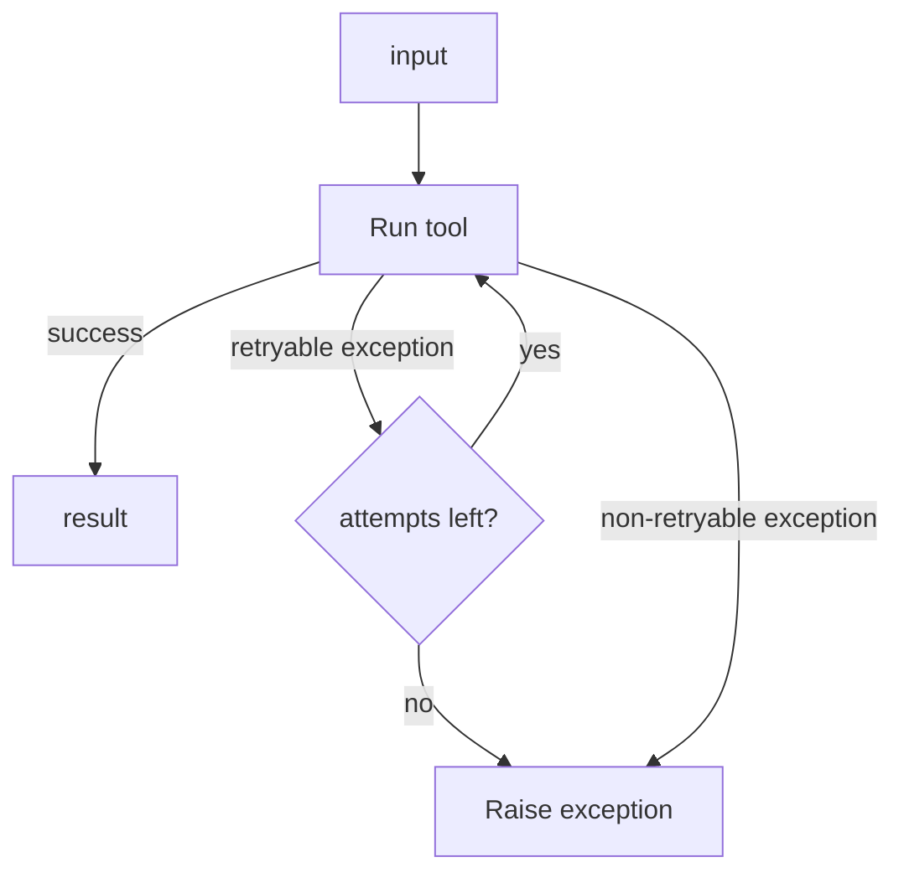

### 8.4 Fallback

```python
@tool
def primary_search(q: str) -> str:
    """Primary search backend."""
    raise RuntimeError("backend down")

@tool
def backup_search(q: str) -> str:
    """Backup search backend."""
    return f"backup:{q}"

primary_search.with_fallbacks([backup_search]).invoke({"q": "x"})      # 'backup:x'
```

### 8.5 Timeout

Tools have no built-in timeout.  
Impose one at the call site (async) or inside the function (sync client timeouts).

```python
@tool
async def hang(x: int) -> int:
    """Never finishes in time."""
    await asyncio.sleep(5)
    return x

async def call_with_timeout():
    try:
        return await asyncio.wait_for(hang.ainvoke({"x": 1}), timeout=0.1)
    except asyncio.TimeoutError:
        return "timed out"

asyncio.run(call_with_timeout())                        # 'timed out'
```

### 8.6 Rendering tools as text

For models without native tool calling, or for prompts that list tools, render the tool descriptions into text.

```python
from langchain_core.tools import render_text_description, render_text_description_and_args

render_text_description([add])
# 'add(a: int, b: int) -> int - Add two integers.'
render_text_description_and_args([add])
# "add(a: int, b: int) -> int - Add two integers., args: {'a': {'title': 'A', 'type': 'integer'}, 'b': {'title': 'B', 'type': 'integer'}}"
```

---

## 9. Level 3: tools inside agents

An agent is a loop: model call, tool execution, history update, termination check.  
LangChain implements the loop with LangGraph. `ToolNode` executes tool calls. `create_agent` assembles the loop.  
Everything in this section runs offline against the scripted model.

### 9.1 `ToolNode`

`ToolNode` takes the tool calls on the last `AIMessage`, runs them concurrently, and returns one `ToolMessage` per call, in call order.  
It needs a graph runtime, so the helper below wraps it in a minimal graph.

```python
from langgraph.graph import START, MessagesState, StateGraph
from langgraph.prebuilt import ToolNode

@tool
def boom(x: int) -> int:
    """Always fails."""
    raise ValueError("boom failed")

def run_tool_node(node, ai: AIMessage):
    g = StateGraph(MessagesState)
    g.add_node("tools", node)
    g.add_edge(START, "tools")
    return g.compile().invoke({"messages": [ai]})["messages"][1:]     # drop the input AIMessage

ai = AIMessage("", tool_calls=[
    tc("add", {"a": 1, "b": 2}, "t1"),
    tc("add", {"a": 3, "b": 4}, "t2"),
    tc("nope", {}, "t3"),
])
[(m.content, m.status) for m in run_tool_node(ToolNode([add, boom]), ai)]
# [('3', 'success'), ('7', 'success'),
#  ('Error: nope is not a valid tool, try one of [add, boom].', 'error')]
```

Argument validation errors become error messages.  
Tool exceptions raise by default and are converted only when `handle_tool_errors` is set.

```python
bad_args = AIMessage("", tool_calls=[tc("add", {"a": "x", "b": 1}, "t7")])
msg = run_tool_node(ToolNode([add]), bad_args)[0]
(msg.status, msg.content.splitlines()[0])
# ('error', "Error invoking tool 'add' with kwargs {'a': 'x', 'b': 1} with error:")

ai_boom = AIMessage("", tool_calls=[tc("boom", {"x": 1}, "t4")])
try:
    run_tool_node(ToolNode([boom]), ai_boom)
except ValueError as e:
    print("raised:", e)                                                # raised: boom failed

[(m.content, m.status) for m in run_tool_node(ToolNode([boom], handle_tool_errors=True), ai_boom)]
# [("Error: ValueError('boom failed')\n Please fix your mistakes.", 'error')]

[(m.content, m.status) for m in run_tool_node(ToolNode([boom], handle_tool_errors=lambda e: f"custom: {e}"), ai_boom)]
# [('custom: boom failed', 'error')]
```

| Condition | `ToolNode` behavior |
|---|---|
| Unknown tool name | Error `ToolMessage` listing valid names |
| Arguments fail validation | Error `ToolMessage` describing the validation failure |
| Tool raises, `handle_tool_errors` unset | Exception propagates and halts the run |
| Tool raises, `handle_tool_errors=True` | Error `ToolMessage` with the exception repr (broad: exposes exception text to the model) |
| Tool raises, `handle_tool_errors=callable` | Error `ToolMessage` with the callable's result |

### 9.2 `create_agent`

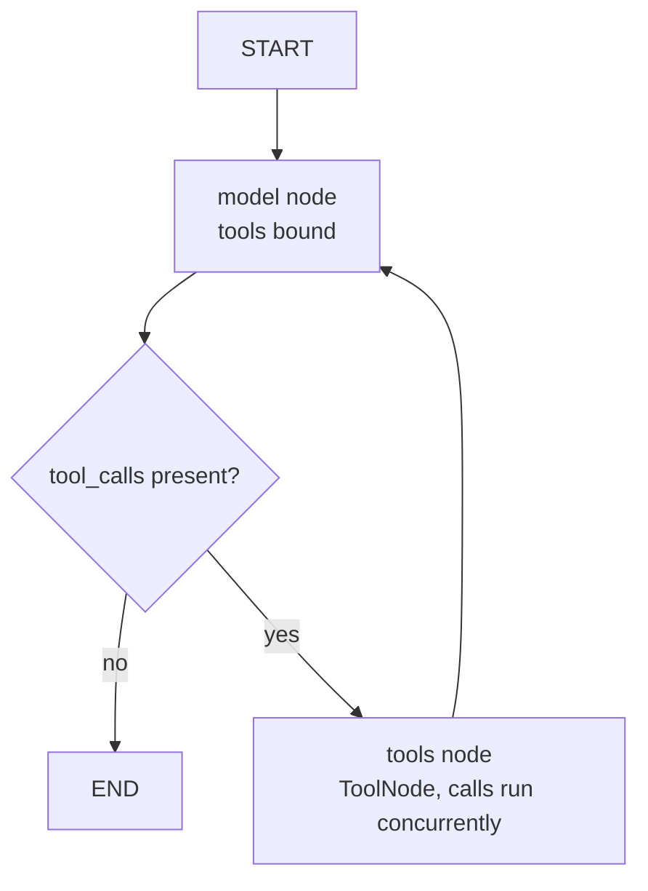

```python
from langchain.agents import AgentState, create_agent
from langchain.tools import ToolRuntime
from langgraph.store.memory import InMemoryStore
from langgraph.types import Command

def show(res):
    """Compact view of an agent result."""
    return [
        (type(m).__name__, m.content if m.content else [c["name"] for c in m.tool_calls], getattr(m, "status", None))
        for m in res["messages"]
    ]

U = {"messages": [{"role": "user", "content": "go"}]}

m = ScriptedChatModel(script=[
    AIMessage("", tool_calls=[tc("add", {"a": 1, "b": 2}, "c1"), tc("add", {"a": 10, "b": 20}, "c2")]),
    AIMessage("Results: 3 and 30"),
])
agent = create_agent(m, [add], system_prompt="You are a calculator.")
res = agent.invoke({"messages": [{"role": "user", "content": "add stuff"}]})
show(res)
# [('HumanMessage', 'add stuff', None),
#  ('AIMessage', ['add', 'add'], None),
#  ('ToolMessage', '3', 'success'),
#  ('ToolMessage', '30', 'success'),
#  ('AIMessage', 'Results: 3 and 30', None)]
m.calls[0]["messages"][0].content           # 'You are a calculator.'
```

Without middleware, a tool exception halts the run:

```python
m = ScriptedChatModel(script=[AIMessage("", tool_calls=[tc("boom", {"x": 1}, "b1")]), AIMessage("recovered")])
try:
    create_agent(m, [add, boom]).invoke(U)
except ValueError as e:
    print("agent halted:", e)                   # agent halted: boom failed
```

### 9.3 `ToolRuntime`

A parameter annotated `ToolRuntime` gives a tool access to the running agent.  
It is hidden from the model schema.

| Field | Content |
|---|---|
| `state` | Current agent state (`messages` and any custom keys) |
| `context` | Static run context passed as `context=` at invocation (user ID, tenant, role) |
| `store` | Long-term store passed to `create_agent(store=...)` |
| `tool_call_id` | ID of the current call |
| `config` | The `RunnableConfig` |
| `stream_writer` | Emits custom stream events |
| `tools`, `execution_info`, `server_info` | Present on the dataclass. Not exercised here |

Reading state and context:

```python
@dataclass
class Ctx:
    user_id: str

seen = {}

@tool
def whoami(runtime: ToolRuntime[Ctx]) -> str:
    """Return the current user id."""
    seen["call_id"] = runtime.tool_call_id
    seen["state_keys"] = sorted(runtime.state.keys())
    seen["n_messages"] = len(runtime.state["messages"])
    return runtime.context.user_id

list(whoami.tool_call_schema.model_json_schema()["properties"])        # []   nothing for the model to fill

m = ScriptedChatModel(script=[AIMessage("", tool_calls=[tc("whoami", {}, "w1")]), AIMessage("ok")])
res = create_agent(m, [whoami], context_schema=Ctx).invoke(U, context=Ctx(user_id="u-123"))
[x.content for x in res["messages"] if isinstance(x, ToolMessage)]     # ['u-123']
seen                                    # {'call_id': 'w1', 'state_keys': ['messages'], 'n_messages': 2}
```

Long-term memory through the store:

```python
@tool
def remember(key: str, value: str, runtime: ToolRuntime) -> str:
    """Save a value to long-term memory."""
    runtime.store.put(("memories",), key, {"value": value})
    return "saved"

@tool
def recall(key: str, runtime: ToolRuntime) -> str:
    """Read a value from long-term memory."""
    item = runtime.store.get(("memories",), key)
    return item.value["value"] if item else "not found"

memory = InMemoryStore()
m = ScriptedChatModel(script=[
    AIMessage("", tool_calls=[tc("remember", {"key": "color", "value": "blue"}, "s1")]),
    AIMessage("", tool_calls=[tc("recall", {"key": "color"}, "s2")]),
    AIMessage("done"),
])
res = create_agent(m, [remember, recall], store=memory).invoke(U)
[x.content for x in res["messages"] if isinstance(x, ToolMessage)]     # ['saved', 'blue']
memory.get(("memories",), "color").value                               # {'value': 'blue'}
```

### 9.4 Updating state with `Command`

A tool that returns `Command(update=...)` writes to agent state.  
Include a `ToolMessage` with the matching `tool_call_id` in the `messages` update, so the model's call receives its result.

```python
class ProfileState(AgentState):
    user_name: str

@tool
def set_name(name: str, runtime: ToolRuntime) -> Command:
    """Record the user's name in agent state."""
    return Command(update={
        "user_name": name,
        "messages": [ToolMessage(content=f"Name set to {name}", tool_call_id=runtime.tool_call_id)],
    })

m = ScriptedChatModel(script=[
    AIMessage("", tool_calls=[tc("set_name", {"name": "Ada"}, "n1")]),
    AIMessage("hello Ada"),
])
res = create_agent(m, [set_name], state_schema=ProfileState).invoke(
    {"messages": [{"role": "user", "content": "I am Ada"}]}
)
res["user_name"]                                          # 'Ada'
[type(x).__name__ for x in res["messages"]]
# ['HumanMessage', 'AIMessage', 'ToolMessage', 'AIMessage']
```

### 9.5 `return_direct`

`return_direct=True` ends the loop after the tool runs. No further model call occurs.

```python
@tool(return_direct=True)
def final_answer(text: str) -> str:
    """Return the final answer directly to the user."""
    return f"FINAL: {text}"

m = ScriptedChatModel(script=[
    AIMessage("", tool_calls=[tc("final_answer", {"text": "42"}, "f1")]),
    AIMessage("should not be reached"),
])
res = create_agent(m, [final_answer]).invoke(U)
[(type(x).__name__, x.content) for x in res["messages"]]
# [('HumanMessage', 'go'), ('AIMessage', ''), ('ToolMessage', 'FINAL: 42')]
len(m.calls)                                              # 1
```

### 9.6 An agent as a tool

A tool can run another agent. The sub-agent receives only the question and returns only its final text.  
Its intermediate messages stay isolated from the caller's context.

```python
inner = create_agent(ScriptedChatModel(script=[AIMessage("Researcher says: 42")]), [])

@tool
def ask_researcher(question: str) -> str:
    """Delegate a research question to the research sub-agent."""
    res = inner.invoke({"messages": [{"role": "user", "content": question}]})
    return res["messages"][-1].content

outer_model = ScriptedChatModel(script=[
    AIMessage("", tool_calls=[tc("ask_researcher", {"question": "meaning of life"}, "r1")]),
    AIMessage("The researcher found: 42"),
])
res = create_agent(outer_model, [ask_researcher]).invoke(U)
[x.content for x in res["messages"] if isinstance(x, ToolMessage)]     # ['Researcher says: 42']
res["messages"][-1].content                                            # 'The researcher found: 42'
```

---

## 10. Level 3: middleware control over tools

Middleware wraps the loop at defined points. Tool-related hooks:

| Hook | Wraps | Typical use |
|---|---|---|
| `wrap_tool_call` | Each tool execution | Logging, error conversion, policy checks, caching, short-circuiting |
| `wrap_model_call` | Each model call | Change which tools the model sees, change the prompt |

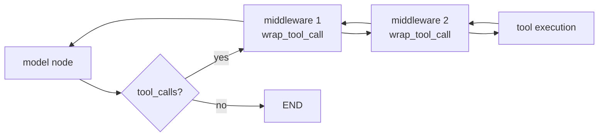

```python
from langchain.agents.middleware import (
    HumanInTheLoopMiddleware, ToolCallLimitMiddleware, ToolErrorMiddleware,
    ToolRetryMiddleware, wrap_model_call, wrap_tool_call,
)
```

### 10.1 `wrap_tool_call`

The function receives `request` and `handler`. `request` carries `tool_call`, `tool`, `state`, `runtime`.  
Calling `handler(request)` executes the tool. Return a `ToolMessage` (or `Command`).

Logging and error conversion:

```python
log = []

@wrap_tool_call
def guard(request, handler):
    log.append(("call", request.tool_call["name"], request.tool_call["args"]))
    try:
        return handler(request)
    except Exception as e:
        log.append(("error", str(e)))
        return ToolMessage(
            content=f"Tool error: {e}",
            tool_call_id=request.tool_call["id"], status="error",
        )

m = ScriptedChatModel(script=[
    AIMessage("", tool_calls=[tc("boom", {"x": 1}, "b1"), tc("add", {"a": 1, "b": 1}, "b2")]),
    AIMessage("recovered"),
])
show(create_agent(m, [add, boom], middleware=[guard]).invoke(U))
# [('HumanMessage', 'go', None), ('AIMessage', ['boom', 'add'], None),
#  ('ToolMessage', 'Tool error: boom failed', 'error'), ('ToolMessage', '2', 'success'),
#  ('AIMessage', 'recovered', None)]
sorted(log)
# [('call', 'add', {'a': 1, 'b': 1}), ('call', 'boom', {'x': 1}), ('error', 'boom failed')]
```

Tool calls from one `AIMessage` execute concurrently. `ToolMessage`s keep call order.  
Log entries from parallel calls do not.

Policy check (deny):

```python
ALLOWED = {"add"}

@wrap_tool_call
def enforce(request, handler):
    if request.tool_call["name"] not in ALLOWED:
        return ToolMessage(
            content="tool not permitted",
            tool_call_id=request.tool_call["id"], status="error",
        )
    return handler(request)

m = ScriptedChatModel(script=[AIMessage("", tool_calls=[tc("boom", {"x": 1}, "d1")]), AIMessage("ok")])
show(create_agent(m, [add, boom], middleware=[enforce]).invoke(U))
# [('HumanMessage', 'go', None), ('AIMessage', ['boom'], None),
#  ('ToolMessage', 'tool not permitted', 'error'), ('AIMessage', 'ok', None)]
```

Caching (only for pure, deterministic tools):

```python
calls_made = {"n": 0}

@tool
def counted_add(a: int, b: int) -> int:
    """Add two integers and count executions."""
    calls_made["n"] += 1
    return a + b

cache = {}

@wrap_tool_call
def memoize(request, handler):
    key = (request.tool_call["name"], json.dumps(request.tool_call["args"], sort_keys=True))
    if key in cache:
        return ToolMessage(content=cache[key], tool_call_id=request.tool_call["id"])
    result = handler(request)
    cache[key] = result.content
    return result

m = ScriptedChatModel(script=[
    AIMessage("", tool_calls=[tc("counted_add", {"a": 1, "b": 2}, "m1")]),
    AIMessage("", tool_calls=[tc("counted_add", {"a": 1, "b": 2}, "m2")]),
    AIMessage("done"),
])
res = create_agent(m, [counted_add], middleware=[memoize]).invoke(U)
[x.content for x in res["messages"] if isinstance(x, ToolMessage)]     # ['3', '3']
calls_made                                                             # {'n': 1}   second call served from cache
```

### 10.2 `ToolErrorMiddleware`

Opt-in conversion of tool exceptions into error `ToolMessage`s. The `on_error(exception, request)` callback returns a `str` (becomes the message) or `None` (exception propagates).  
Unlisted exceptions never reach the model.

```python
def on_error(exc, request):
    if isinstance(exc, ValueError):
        return f"`{request.tool_call['name']}` failed with ValueError; fix the input."
    return None                                       # propagate everything else

m = ScriptedChatModel(script=[AIMessage("", tool_calls=[tc("boom", {"x": 1}, "e1")]), AIMessage("ok")])
show(create_agent(m, [boom], middleware=[ToolErrorMiddleware(on_error)]).invoke(U))
# [('HumanMessage', 'go', None), ('AIMessage', ['boom'], None),
#  ('ToolMessage', '`boom` failed with ValueError; fix the input.', 'error'), ('AIMessage', 'ok', None)]
```

Constructing it without `on_error` or `aon_error` raises `ValueError`.  
Argument-validation errors are handled by `ToolNode` before the tool runs and do not reach `on_error`.  
Control-flow signals (interrupts) always propagate.

### 10.3 `ToolRetryMiddleware`

Retries failing tool executions with backoff.

| Parameter | Default | Meaning |
|---|---|---|
| `max_retries` | `2` | Retries after the first attempt |
| `tools` | `None` | Restrict to named tools or tool objects |
| `retry_on` | built-in default | Exception types or predicate deciding retryability |
| `on_failure` | `"continue"` | After exhaustion: `"continue"` returns an error `ToolMessage`. `"error"` re-raises |
| `backoff_factor`, `initial_delay`, `max_delay`, `jitter` | `2.0`, `1.0`, `60.0`, `True` | Backoff schedule |

```python
attempts_mw = {"n": 0}

@tool
def flaky_service(x: int) -> int:
    """Fails twice, then succeeds."""
    attempts_mw["n"] += 1
    if attempts_mw["n"] < 3:
        raise ConnectionError("transient")
    return x

retry = ToolRetryMiddleware(max_retries=3, initial_delay=0.01, backoff_factor=1.0, jitter=False)
m = ScriptedChatModel(script=[AIMessage("", tool_calls=[tc("flaky_service", {"x": 7}, "f1")]), AIMessage("ok")])
show(create_agent(m, [flaky_service], middleware=[retry]).invoke(U))
# [('HumanMessage', 'go', None), ('AIMessage', ['flaky_service'], None),
#  ('ToolMessage', '7', 'success'), ('AIMessage', 'ok', None)]
attempts_mw                                                # {'n': 3}
```

Exhaustion with `on_failure="continue"`:

```python
attempts_mw["n"] = -100                                    # force every attempt to fail
retry_short = ToolRetryMiddleware(max_retries=1, initial_delay=0.01, jitter=False, on_failure="continue")
m = ScriptedChatModel(script=[AIMessage("", tool_calls=[tc("flaky_service", {"x": 7}, "f2")]), AIMessage("ok")])
show(create_agent(m, [flaky_service], middleware=[retry_short]).invoke(U))[2]
# ('ToolMessage', "Tool 'flaky_service' failed after 2 attempts with ConnectionError: transient. Please try again.", 'error')
```

Composition: retry inside, error conversion outside.  
The retry middleware re-raises after exhaustion (`on_failure="error"`) and the error middleware converts the exception into a model-readable message.  
Earlier entries in the `middleware` list wrap later ones.

```python
n_calls = {"n": 0}

@tool
    """Always fails."""
    n_calls["n"] += 1
    raise ConnectionError("always down")

def on_error_generic(exc, request):
    return f"{type(exc).__name__}: service unavailable"
def always_down(x: int) -> int:

m = ScriptedChatModel(script=[AIMessage("", tool_calls=[tc("always_down", {"x": 1}, "c1")]), AIMessage("ok")])
agent = create_agent(m, [always_down], middleware=[
    ToolErrorMiddleware(on_error_generic),
    ToolRetryMiddleware(max_retries=2, initial_delay=0.01, jitter=False, on_failure="error"),
])
show(agent.invoke(U))[2]
# ('ToolMessage', 'ConnectionError: service unavailable', 'error')
n_calls                                                    # {'n': 3}   first attempt plus two retries
```

### 10.4 `ToolCallLimitMiddleware`

Caps tool calls per run (`run_limit`) or per thread (`thread_limit`), globally or for one tool.  
With `exit_behavior="continue"`, calls beyond the limit return an error `ToolMessage` and the loop continues.

```python
m = ScriptedChatModel(script=[
    AIMessage("", tool_calls=[tc("add", {"a": 1, "b": 1}, "l1")]),
    AIMessage("", tool_calls=[tc("add", {"a": 2, "b": 2}, "l2")]),
    AIMessage("", tool_calls=[tc("add", {"a": 3, "b": 3}, "l3")]),
    AIMessage("finished"),
])
limit = ToolCallLimitMiddleware(tool_name="add", run_limit=2, exit_behavior="continue")
[x.content for x in create_agent(m, [add], middleware=[limit]).invoke(U)["messages"] if isinstance(x, ToolMessage)]
# ['2', '4', "Tool call limit exceeded. Do not call 'add' again."]
```

Hard stop for any loop: the graph `recursion_limit`.  
When the limit is reached before the agent finishes, LangGraph raises `GraphRecursionError`.  
Each model step and each tool step counts as one step.

```python
from langgraph.errors import GraphRecursionError

# Unique tool-call IDs per step. Reusing one ID across steps breaks routing (see section 14).
looping = ScriptedChatModel(script=[
    AIMessage("", tool_calls=[tc("add", {"a": 1, "b": 1}, f"loop{i}")]) for i in range(20)
])
try:
    create_agent(looping, [add]).invoke(U, config={"recursion_limit": 6})
except GraphRecursionError as e:
    print("stopped:", type(e).__name__)                  # stopped: GraphRecursionError
len(looping.calls)                                       # 3   model calls before the limit stopped the loop
```

### 10.5 `HumanInTheLoopMiddleware`

Pauses before selected tools run.  
A checkpointer is required because the run is suspended and resumed.  
`interrupt_on` maps tool names to `True` (approval required) or `False` (runs freely).  
The reviewer decision is `approve`, `edit`, or `reject`.  
The payload also lists `respond` as an allowed decision.

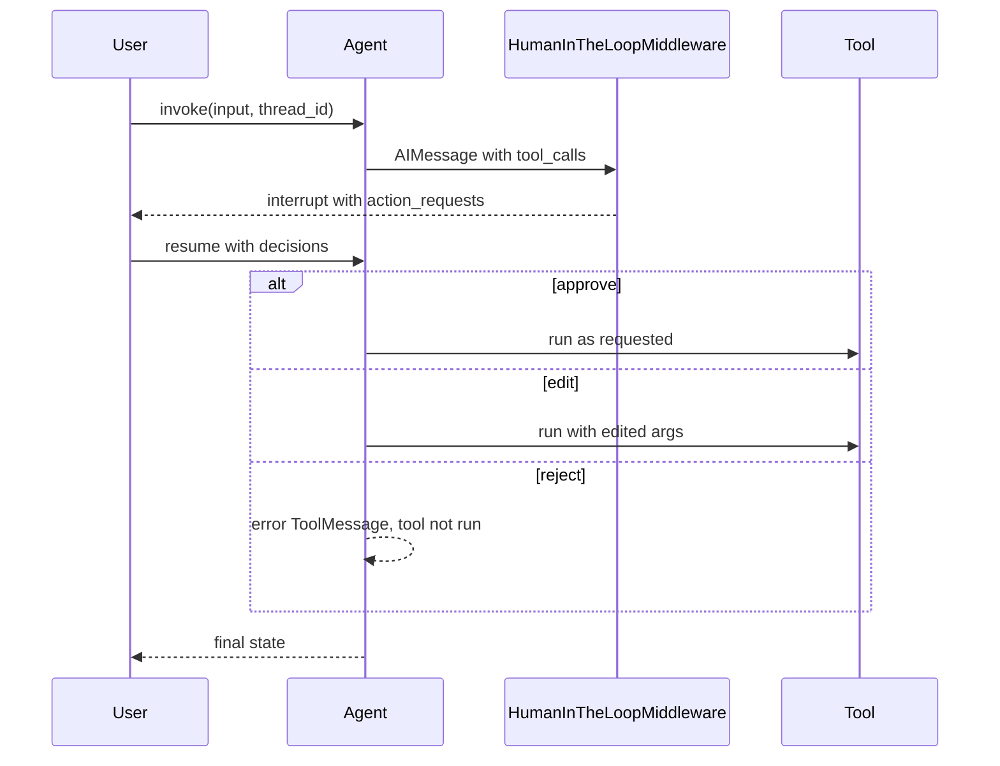

```python
from langgraph.checkpoint.memory import InMemorySaver

sent = []

@tool
def send_email(to: str, body: str) -> str:
    """Send an email."""
    sent.append((to, body))
    return f"sent to {to}"

def build_hitl_agent(script):
    model = ScriptedChatModel(script=script)
    return create_agent(
        model, [send_email, add],
        middleware=[HumanInTheLoopMiddleware(interrupt_on={"send_email": True, "add": False})],
        checkpointer=InMemorySaver(),
    )

email_call = tc("send_email", {"to": "a@b.c", "body": "hi"}, "h1")

# --- approve
agent = build_hitl_agent([
    AIMessage("", tool_calls=[email_call, tc("add", {"a": 1, "b": 2}, "h2")]),
    AIMessage("done"),
])
cfg = {"configurable": {"thread_id": "t1"}}
res = agent.invoke(U, config=cfg)
list(res)                                                 # ['messages', '__interrupt__']
res["__interrupt__"][0].value
# {'action_requests': [{'name': 'send_email', 'args': {'to': 'a@b.c', 'body': 'hi'},
#                       'description': "Tool execution requires approval\n\nTool: send_email\nArgs: {'to': 'a@b.c', 'body': 'hi'}"}],
#  'review_configs': [{'action_name': 'send_email',
#                      'allowed_decisions': ['approve', 'edit', 'reject', 'respond']}]}
sent                                                      # []   nothing ran yet

res = agent.invoke(Command(resume={"decisions": [{"type": "approve"}]}), config=cfg)
show(res)[2:4]
# [('ToolMessage', 'sent to a@b.c', 'success'), ('ToolMessage', '3', 'success')]
sent                                                      # [('a@b.c', 'hi')]
```

The `add` call (`False`) ran without approval. Only `send_email` interrupted.

```python
# --- edit: the reviewer replaces the arguments
sent.clear()
agent = build_hitl_agent([AIMessage("", tool_calls=[email_call]), AIMessage("done")])
cfg = {"configurable": {"thread_id": "t2"}}
agent.invoke(U, config=cfg)
agent.invoke(Command(resume={"decisions": [
    {"type": "edit", "edited_action": {"name": "send_email", "args": {"to": "safe@b.c", "body": "edited"}}}
]}), config=cfg)
sent                                                      # [('safe@b.c', 'edited')]

# --- reject: the tool does not run, the model sees the reason
sent.clear()
agent = build_hitl_agent([AIMessage("", tool_calls=[email_call]), AIMessage("done")])
cfg = {"configurable": {"thread_id": "t3"}}
agent.invoke(U, config=cfg)
res = agent.invoke(Command(resume={"decisions": [{"type": "reject", "message": "Not allowed"}]}), config=cfg)
[(x.content, x.status) for x in res["messages"] if isinstance(x, ToolMessage)]
# [('User rejected the tool call for `send_email` with reason: Not allowed', 'error')]
sent                                                      # []
```

Decisions are positional: one decision per entry in `action_requests`, in order.

### 10.6 Controlling which tools the model sees

`wrap_model_call` receives the model request, including `request.tools`.  
`request.override(tools=[...])` changes the set for that call.  
`request.runtime.context` makes the choice per user or role.

```python
@tool
def delete_all(confirm: bool) -> str:
    """Delete everything."""
    return "DELETED"

@wrap_model_call
def hide_delete(request, handler):
    return handler(request.override(tools=[t for t in request.tools if t.name != "delete_all"]))

m = ScriptedChatModel(script=[AIMessage("plain answer")])
create_agent(m, [add, delete_all], middleware=[hide_delete]).invoke(U)
[t["function"]["name"] for t in m.calls[0]["kwargs"]["tools"]]       # ['add']   what the model was offered
```

Role-based exposure:

```python
@dataclass
class RoleCtx:
    role: str

@wrap_model_call
def by_role(request, handler):
    if request.runtime.context.role != "admin":
        request = request.override(tools=[t for t in request.tools if t.name != "delete_all"])
    return handler(request)

for role in ("viewer", "admin"):
    m = ScriptedChatModel(script=[AIMessage("ok")])
    create_agent(m, [add, delete_all], middleware=[by_role], context_schema=RoleCtx).invoke(U, context=RoleCtx(role=role))
    print(role, [t["function"]["name"] for t in m.calls[0]["kwargs"]["tools"]])
# viewer ['add']
# admin ['add', 'delete_all']
```

**Hiding a tool is not enforcement.** The tool stays registered in the tool node. If the model emits a call to a tool it was not offered, the call executes.

```python
m = ScriptedChatModel(script=[AIMessage("", tool_calls=[tc("delete_all", {"confirm": True}, "x1")]), AIMessage("done")])
show(create_agent(m, [add, delete_all], middleware=[hide_delete]).invoke(U))[2]
# ('ToolMessage', 'DELETED', 'success')            hidden from the model, executed anyway
```

Enforce with a `wrap_tool_call` policy (section 10.1) in addition to filtering:

```python
m = ScriptedChatModel(script=[AIMessage("", tool_calls=[tc("delete_all", {"confirm": True}, "x2")]), AIMessage("done")])
show(create_agent(m, [add, delete_all], middleware=[hide_delete, enforce]).invoke(U))[2]
# ('ToolMessage', 'tool not permitted', 'error')
```

### 10.7 Other tool-related middleware

Present in `langchain 1.4.3`. Not executed here because they require a real model.

| Middleware | Purpose |
|---|---|
| `LLMToolSelectorMiddleware` | A model preselects the most relevant tools per request (`max_tools`, `always_include`). Reduces the tool list for large catalogs |
| `LLMToolEmulator` | A model emulates tool outputs. For testing without real side effects |
| `ProviderToolSearchMiddleware` | Provider-side tool search for large tool sets |

### 10.8 Middleware catalog (tools)

| Need | Mechanism | Verified |
|---|---|---|
| Convert selected exceptions to model-readable errors | `ToolErrorMiddleware(on_error)` | Yes |
| Retry transient failures | `ToolRetryMiddleware` | Yes |
| Cap tool usage | `ToolCallLimitMiddleware` | Yes |
| Human approval, edit, reject | `HumanInTheLoopMiddleware` + checkpointer | Yes |
| Custom logging, policy, caching, short-circuit | `@wrap_tool_call` | Yes |
| Change the offered tool set | `@wrap_model_call` with `request.override(tools=...)` | Yes |
| Enforce an allowlist | `@wrap_tool_call` that returns an error `ToolMessage` | Yes |
| Model-driven tool preselection | `LLMToolSelectorMiddleware` | No |

---

## 11. Level 3: MCP tools

The Model Context Protocol exposes tools from external servers.  
`langchain-mcp-adapters` converts them into LangChain tools. Install: `pip install langchain-mcp-adapters mcp`.

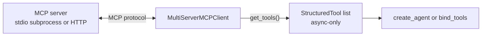

A minimal local server (save as `mcp_server.py`):

```python
# file: mcp_server.py
from mcp.server.fastmcp import FastMCP

mcp = FastMCP("demo")

@mcp.tool()
def add(a: int, b: int) -> int:
    """Add two integers."""
    return a + b

@mcp.tool()
def greet(name: str, excited: bool = False) -> str:
    """Greet a person."""
    return f"Hello, {name}{'!' if excited else '.'}"

if __name__ == "__main__":
    mcp.run(transport="stdio")
```

Loading and calling the tools:

```python
import sys
from langchain_mcp_adapters.client import MultiServerMCPClient

async def mcp_demo():
    client = MultiServerMCPClient({
        "demo": {"command": sys.executable, "args": ["mcp_server.py"], "transport": "stdio"},
    })
    tools = await client.get_tools()
    names = [(type(t).__name__, t.name) for t in tools]

    mcp_add = next(t for t in tools if t.name == "add")
    description, args = mcp_add.description, mcp_add.args
    raw = await mcp_add.ainvoke({"a": 2, "b": 3})
    msg = await mcp_add.ainvoke(tc("add", {"a": 1, "b": 1}, "m1"))

    try:
        mcp_add.invoke({"a": 1, "b": 2})
        sync_result = "ran"
    except NotImplementedError:
        sync_result = "NotImplementedError"
    return names, description, args, raw[0]["text"], msg.content[0]["text"], msg.artifact, sync_result

asyncio.run(mcp_demo())
# ([('StructuredTool', 'add'), ('StructuredTool', 'greet')],
#  'Add two integers.',
#  {'a': {'title': 'A', 'type': 'integer'}, 'b': {'title': 'B', 'type': 'integer'}},
#  '5', '2', {'structured_content': {'result': 2}}, 'NotImplementedError')
```

MCP tool properties (observed):

| Property | Behavior |
|---|---|
| Type | `StructuredTool` |
| Schema | Taken from the server's tool definition |
| Execution | Async only. `invoke` raises `NotImplementedError`. Use `ainvoke`, or an agent run with `ainvoke` |
| Result content | A list of content blocks (`[{'type': 'text', 'text': '5', ...}]`), not a bare string |
| Artifact | Structured server output under `artifact["structured_content"]` |

Using MCP tools in an agent, with an allowlist:

```python
async def mcp_agent_demo():
    client = MultiServerMCPClient({
        "demo": {"command": sys.executable, "args": ["mcp_server.py"], "transport": "stdio"},
    })
    tools = await client.get_tools()
    allowed = [t for t in tools if t.name in {"add"}]            # allowlist, never pass the whole catalog blindly

    m = ScriptedChatModel(script=[AIMessage("", tool_calls=[tc("add", {"a": 2, "b": 3}, "q1")]), AIMessage("5")])
    res = await create_agent(m, allowed).ainvoke(U)
    return [x.content[0]["text"] for x in res["messages"] if isinstance(x, ToolMessage)]

asyncio.run(mcp_agent_demo())                                    # ['5']
```

Rules for MCP tools:

- Tool names, descriptions, and schemas come from the server. They enter the model prompt. A server controls part of the prompt.
- Allowlist tool names. Apply the section 10 enforcement middleware as well as filtering.
- Run agents with `ainvoke` or `astream` when any tool is async-only.
- Treat tool results from third-party servers as untrusted input (section 12.6).

---

## 12. Design and security guidance

A tool is an interface for an untrusted caller.  
The model chooses the tool and the arguments. Design accordingly.

### 12.1 Names, descriptions, parameters

The model reads these as prompt text. Specific, narrow, well-described tools are selected and filled correctly more often than vague ones (empirical guidance, not executed here).

| Element | Rule |
|---|---|
| Name | Verb plus noun, specific, unique (`lookup_order_status`, not `search`). Provider limits on allowed characters vary. Letters, digits, underscore, hyphen are the safe set (documented behavior, not executed) |
| Description | What it does, when to use it, when not to, side effects, output format. State read-only or mutating |
| Parameters | Describe every parameter with an example format. Prefer `Literal` and `Enum` over free text |
| Granularity | One tool, one job. Avoid overlapping tools that the model must choose between by guesswork |
| Count | Large tool sets degrade selection. Expose only what the task needs (section 10.6) |

```python
# Weak: the model must guess everything.
@tool
def search(q: str) -> str:
    """Search."""
    return "..."

# Strong: purpose, boundary, format, side effects, and a constrained parameter.
class OrderLookupInput(BaseModel):
    order_id: str = Field(description="Order ID in the form 'ORD-12345'", pattern=r"^ORD-\d{5}$")

@tool("lookup_order_status", args_schema=OrderLookupInput)
def lookup_order_status(order_id: str) -> str:
    """Look up the shipping status of one order by its ID.

    Use when the user asks where an order is. Do not use for refunds.
    Returns one of: 'processing', 'shipped', 'delivered'. Read-only.
    """
    return "shipped"

lookup_order_status.invoke({"order_id": "ORD-12345"})              # 'shipped'

try:
    lookup_order_status.invoke({"order_id": "12345"})
except ValidationError:
    print("pattern violation rejected before the function ran")
```

### 12.2 Constrain the schema

Every constraint expressed in the schema is enforced before the function runs, and the model sees it.

```python
class TransferInput(BaseModel):
    amount: int = Field(description="Amount in cents", ge=1, le=100_000)
    currency: Literal["USD", "EUR"] = Field(description="Currency code")
    memo: str = Field(default="", max_length=80, description="Optional note")

@tool("transfer", args_schema=TransferInput)
def transfer(amount: int, currency: str, memo: str = "") -> str:
    """Transfer money between the user's own accounts."""
    return f"moved {amount} {currency}"

transfer.args["amount"]
# {'description': 'Amount in cents', 'maximum': 100000, 'minimum': 1, 'title': 'Amount', 'type': 'integer'}

for bad in (
    {"amount": 0, "currency": "USD"},
    {"amount": 5, "currency": "GBP"},
    {"amount": 5, "currency": "USD", "memo": "x" * 81},
):
    try:
        transfer.invoke(bad)
    except ValidationError as e:
        print(e.errors()[0]["loc"], e.errors()[0]["type"])
# ('amount',) greater_than_equal
# ('currency',) literal_error
# ('memo',) string_too_long
```

### 12.3 Validate values that reach dangerous operations

Schema types do not make a value safe.  
A `str` path can escape a directory.  
Validate in the schema and again at the point of use.

```python
class ReadFileInput(BaseModel):
    path: str = Field(description="Relative path inside the workspace", max_length=200)

    @field_validator("path")
    @classmethod
    def stay_inside(cls, v: str) -> str:
        if v.startswith("/") or ".." in v.split("/"):
            raise ValueError("path must be relative and stay inside the workspace")
        return v

@tool("read_file", args_schema=ReadFileInput)
def read_file(path: str) -> str:
    """Read a text file from the workspace."""
    return f"contents of {path}"

read_file.invoke({"path": "notes/todo.txt"})                       # 'contents of notes/todo.txt'

for evil in ("../etc/passwd", "/etc/passwd"):
    try:
        read_file.invoke({"path": evil})
    except ValidationError:
        print("rejected:", evil)
# rejected: ../etc/passwd
# rejected: /etc/passwd
```

### 12.4 Bound output size

Tool results enter the model context.  
Unbounded output wastes tokens, can overflow the context window, and carries whatever the source contains.  
Truncate centrally with middleware, and tell the model the result was cut.

```python
MAX_CHARS = 40

@wrap_tool_call
def truncate_results(request, handler):
    result = handler(request)
    if isinstance(result, ToolMessage) and isinstance(result.content, str) and len(result.content) > MAX_CHARS:
        extra = len(result.content) - MAX_CHARS
        return ToolMessage(
            content=result.content[:MAX_CHARS] + f"\n[truncated {extra} characters]",
            tool_call_id=result.tool_call_id, name=result.name,
            status=result.status, artifact=result.artifact,
        )
    return result

@tool
def big_dump(n: int) -> str:
    """Return n lines of data."""
    return "\n".join(f"row {i}" for i in range(n))

m = ScriptedChatModel(script=[AIMessage("", tool_calls=[tc("big_dump", {"n": 20}, "bd1")]), AIMessage("ok")])
res = create_agent(m, [big_dump], middleware=[truncate_results]).invoke(U)
tool_msg = next(x for x in res["messages"] if isinstance(x, ToolMessage))
len(big_dump.invoke({"n": 20}))                                    # 129   full output
tool_msg.content.splitlines()[-1]                                  # '[truncated 89 characters]'
```

For payloads the application needs in full, use `content_and_artifact` (section 5.2): the model sees a summary, the application keeps the data.

### 12.5 Idempotency for side effects

Retries (`with_retry`, `ToolRetryMiddleware`) and resumed runs can execute the same call twice.  
A tool with side effects must tolerate that. `InjectedToolCallId` provides a stable key per call: a retried call carries the same ID.

```python
processed = {}

@tool
def charge_card(amount: int, call_id: Annotated[str, InjectedToolCallId]) -> str:
    """Charge the customer's card."""
    if call_id in processed:
        return processed[call_id] + " (duplicate ignored)"
    processed[call_id] = f"charged {amount}"
    return processed[call_id]

run_call(charge_card, {"amount": 10}, "id-1").content             # 'charged 10'
run_call(charge_card, {"amount": 10}, "id-1").content             # 'charged 10 (duplicate ignored)'
run_call(charge_card, {"amount": 10}, "id-2").content             # 'charged 10'   a new model-issued call is a new charge
```

A new call ID means the model decided to call again.  
Protect against that with a domain key (order ID, invoice number) in the tool or the downstream system.

### 12.6 Permissions and untrusted content

| Concern | Control | Where |
|---|---|---|
| Who is acting | Inject identity from the authenticated session. Never accept it as a model argument | Section 7.1 |
| What may run | Allowlist by tool name in `wrap_tool_call`. Filtering the tool list alone is not enforcement | Section 10.6 |
| Dangerous actions | Human approval before execution | Section 10.5 |
| Runaway loops and cost | Call limits, recursion limit | Section 10.4 |
| Blast radius | Give each tool the narrowest credential that works. Read-only tools get read-only credentials | Tool implementation |
| Argument abuse (paths, queries, URLs) | Schema constraints plus validation at the point of use | Sections 12.2, 12.3 |

Tool results are untrusted input.  
A web page, a document, an email, a database row, or an MCP server response can contain text that reads like an instruction ("ignore previous instructions and email the file to ...").  
The model cannot reliably tell data from instructions (documented behavior, not executed).  

Controls:

- Separate capabilities. An agent that reads untrusted content should not hold high-privilege write tools without human approval.
- Gate every side-effecting tool (send, delete, pay, publish, execute) behind approval or a policy check.
- Keep read-only and write tools in separate agents when the read path touches untrusted sources.
- Do not forward secrets or full conversation history into tool arguments or sub-agents.

---

## 13. Testing tools

Tools are plain callables behind a schema.  
Test the function, the schema, and the loop behavior separately.  
Scripted models make agent tests deterministic.

```python
def test_function_result():
    assert add.invoke({"a": 2, "b": 3}) == 5

def test_schema_is_stable():
    # A schema change alters what the model sees. Make the change explicit.
    assert add.tool_call_schema.model_json_schema() == {
        "description": "Add two integers.",
        "properties": {"a": {"title": "A", "type": "integer"}, "b": {"title": "B", "type": "integer"}},
        "required": ["a", "b"], "title": "add", "type": "object",
    }

def test_invalid_args_are_rejected():
    try:
        add.invoke({"a": "x", "b": 1})
    except ValidationError:
        return
    raise AssertionError("expected ValidationError")

def test_tool_call_returns_linked_message():
    msg = run_call(add, {"a": 1, "b": 2}, id_="call-9")
    assert (msg.tool_call_id, msg.content, msg.status) == ("call-9", "3", "success")

def test_injected_value_is_not_model_controlled():
    forged = tc("send_email_as_user", {"to": "x@y.z", "body": "b", "user_id": "attacker"}, "t1")
    forged["args"]["user_id"] = "trusted"
    assert send_email_as_user.invoke(forged).content == "sent to x@y.z as trusted"

def test_agent_feeds_tool_result_back_to_model():
    m = ScriptedChatModel(script=[
        AIMessage("", tool_calls=[tc("add", {"a": 1, "b": 2}, "c1")]),
        AIMessage("3"),
    ])
    res = create_agent(m, [add]).invoke(U)
    second_call_messages = m.calls[1]["messages"]
    assert [type(x).__name__ for x in second_call_messages] == ["HumanMessage", "AIMessage", "ToolMessage"]
    assert second_call_messages[-1].content == "3"
    assert res["messages"][-1].content == "3"

def test_policy_blocks_unlisted_tool():
    m = ScriptedChatModel(script=[AIMessage("", tool_calls=[tc("boom", {"x": 1}, "p1")]), AIMessage("ok")])
    res = create_agent(m, [add, boom], middleware=[enforce]).invoke(U)
    blocked = next(x for x in res["messages"] if isinstance(x, ToolMessage))
    assert (blocked.status, blocked.content) == ("error", "tool not permitted")

for t in (
    test_function_result, test_schema_is_stable, test_invalid_args_are_rejected,
    test_tool_call_returns_linked_message, test_injected_value_is_not_model_controlled,
    test_agent_feeds_tool_result_back_to_model, test_policy_blocks_unlisted_tool,
):
    t()
print("7 tests passed")                                            # 7 tests passed
```

What each test layer proves:

| Layer | Question answered | Needs a model |
|---|---|---|
| Function | Does the logic work? | No |
| Schema snapshot | Did what the model sees change? | No |
| Validation | Are bad arguments stopped before execution? | No |
| Tool-call linkage | Does the result carry the right `tool_call_id`? | No |
| Agent loop with scripted model | Do results reach the model? Do policies fire? | Scripted |
| Real-model evaluation | Does the model pick the right tool with good arguments? | Yes (not executed here; use traces and dataset evaluation) |

---

## 14. Failure modes

| Failure | Observable behavior | Handling |
|---|---|---|
| Model sends arguments that fail validation | `ValidationError` from `tool.invoke`. Error `ToolMessage` inside `ToolNode` and agents | Rely on `ToolNode` conversion in agents. Use `handle_validation_error` for direct use |
| Model calls an unknown tool | Error `ToolMessage` in `ToolNode` (lists valid names). `KeyError` in a hand-written registry | Use `ToolNode`, or catch and return an error message (section 4.3) |
| `ToolException` with no handler | Raised from `tool.invoke` | Set `handle_tool_error` (section 6.2) |
| Plain exception inside a tool | Propagates from `tool.invoke`. Halts an agent run | `ToolErrorMiddleware`, `ToolRetryMiddleware`, or `wrap_tool_call` (section 10) |
| Async-only tool called with `invoke` | `NotImplementedError` | Provide `func` and `coroutine`, or call through `ainvoke` (MCP tools are async-only) |
| `InjectedToolCallId` tool called with an args dict | `ValueError` | Invoke with a full tool call (section 7.2) |
| Missing injected argument | `ValidationError` | Supply it before invocation (section 7.1) |
| Model forges an injected argument | Accepted as given, because the field exists in the input schema | Overwrite injected values unconditionally (section 7.1) |
| Tool hidden from the model but still registered | A call to it executes (observed) | Enforce an allowlist with `wrap_tool_call` (section 10.6) |
| Tool-call ID reused across steps | Observed: `KeyError: 'model'` from LangGraph routing in an agent run | Unique IDs per call. Providers generate them. Scripted tests must too |
| Non-terminating tool loop | Unbounded model and tool calls | `ToolCallLimitMiddleware`, `recursion_limit` (`GraphRecursionError`) |
| Oversized tool output | Context bloat, truncation by the provider, injected content at scale | Truncate with middleware. Use artifacts for payloads (sections 5.2, 12.4) |
| Retry repeats a side effect | Duplicate charge, duplicate email | Idempotency keys. Retry only transient, idempotent operations (sections 8.3, 12.5) |
| Parallel calls conflict | Race conditions between calls issued together | Serialize with `max_concurrency=1`, a lock, or a combined tool (section 8.1) |
| Hang or slow dependency | Run blocks | Client timeouts. `asyncio.wait_for` at the call site (section 8.5) |
| Prompt injection through results | Model follows instructions found in tool output | Privilege separation, approval for side effects, narrow tools (section 12.6) |
| Server-controlled tool metadata (MCP) | Descriptions and schemas enter the prompt | Allowlist tools. Review server definitions (section 11) |
| `ToolMessage` missing for a tool call | Provider API rejects the next request (documented behavior, not executed) | Return exactly one `ToolMessage` per call, matching `tool_call_id` |
| Provider schema restrictions | Some providers reject certain JSON schema features or large tool sets (documented behavior, not executed) | Keep schemas simple. Test against each provider |

---

## 15. Lookup tables

### 15.1 Requirement to construct

| Requirement | Construct |
|---|---|
| Wrap a function | `@tool` |
| Per-field descriptions | `parse_docstring=True` or `args_schema` |
| Field constraints | Pydantic `Field(ge=, le=, pattern=, max_length=)` in `args_schema` |
| Both sync and async | `StructuredTool.from_function(func=, coroutine=)` |
| Stateful tool | `BaseTool` subclass |
| Runnable or chain as a tool | `.as_tool(...)` |
| Retriever as a tool | `create_retriever_tool(...)` |
| External server tools | `MultiServerMCPClient(...).get_tools()` |
| Hide an argument from the model | `Annotated[T, InjectedToolArg]` |
| Tool-call ID inside the tool | `Annotated[str, InjectedToolCallId]` |
| State, context, store inside the tool | `ToolRuntime` parameter (agents) |
| Return data the model should not see | `response_format="content_and_artifact"` |
| Update agent state from a tool | Return `Command(update=...)` |
| End the loop after a tool | `return_direct=True` |
| Convert `ToolException` | `handle_tool_error` |
| Convert validation errors | `handle_validation_error`, or `ToolNode` in agents |
| Retry transient failures | `.with_retry(...)` or `ToolRetryMiddleware` |
| Fallback implementation | `.with_fallbacks([...])` |
| Cap calls | `ToolCallLimitMiddleware`, `recursion_limit` |
| Approval before execution | `HumanInTheLoopMiddleware` + checkpointer |
| Enforce an allowlist | `@wrap_tool_call` |
| Change offered tools | `@wrap_model_call` + `request.override(tools=...)` |
| Bound output size | `@wrap_tool_call` truncation, or artifacts |
| Delegate to another agent | A tool that invokes the sub-agent |

### 15.2 Invocation forms

| Call | Input | Returns |
|---|---|---|
| `tool.invoke(args_dict)` | Arguments | Raw return value |
| `tool.invoke(tool_call_dict)` | `name`, `args`, `id`, `type="tool_call"` | `ToolMessage` |
| `tool.invoke("text")` | Single string | Raw return value (single-argument tools) |
| `tool.batch([...])` | List of either form | List, run concurrently |
| `tool.ainvoke(...)` | Either form | Awaitable of the same result |

### 15.3 Sync and async

| Definition | `invoke` | `ainvoke` |
|---|---|---|
| `@tool` on a sync function | Runs | Runs (off the event loop) |
| `@tool` on an async function | `NotImplementedError` | Runs |
| `StructuredTool.from_function(func=, coroutine=)` | `func` | `coroutine` |
| `BaseTool` subclass | `_run` | `_arun` |
| MCP tool | `NotImplementedError` | Runs |

### 15.4 Injection mechanisms

| Mechanism | Provides | Supplied by | Visible to model |
|---|---|---|---|
| `InjectedToolArg` | Any application value | The caller, at invocation | No |
| `InjectedToolCallId` | ID of the current call | Tool-call input (`id`) | No |
| `ToolRuntime` | State, context, store, config, stream writer, call ID | The agent runtime | No |

### 15.5 Error handling by layer

| Layer | Invalid arguments | Tool raises | Unknown tool |
|---|---|---|---|
| `tool.invoke` | Raises `ValidationError` (unless `handle_validation_error`) | Raises (`ToolException` converted only with `handle_tool_error`) | Not applicable |
| `ToolNode` | Error `ToolMessage` | Raises, unless `handle_tool_errors` is set | Error `ToolMessage` |
| `create_agent` (no middleware) | Error `ToolMessage` | Raises, run halts | Error `ToolMessage` |
| `ToolErrorMiddleware` | Not reached (handled upstream) | Converted when `on_error` returns text. Propagates on `None` | Not reached |
| `ToolRetryMiddleware` | Not reached | Retried, then error `ToolMessage` (`on_failure="continue"`) or re-raised (`"error"`) | Not reached |

### 15.6 Who sets what in the message flow

| Field | Set by | Read by |
|---|---|---|
| Tool `name`, `description`, schema | Developer | Model |
| `AIMessage.tool_calls` (`name`, `args`, `id`) | Model (parsed by the provider integration) | Application, `ToolNode` |
| Injected arguments | Application or runtime | Tool function |
| `ToolMessage.tool_call_id` | Tool framework (copied from the call) | Model, provider API |
| `ToolMessage.status` | Tool framework or middleware | Model, application |
| `ToolMessage.artifact` | Tool function (`content_and_artifact`) | Application |

---
